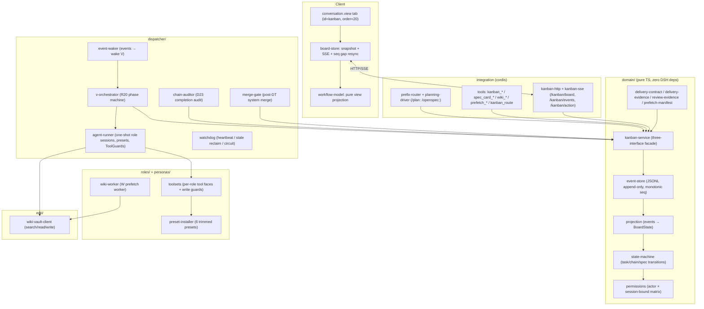

# dsh-kanban

[English](README.md) · [简体中文](README.zh-CN.md)

---

**A multi-role, event-sourced task kanban for DSH (DeepSeek Harness).**

dsh-kanban turns a single planning session into a governed, observable execution
pipeline: an orchestrator (V) decomposes an approved spec into a strictly ordered
phase chain, six single-purpose agent roles (V / P / W / D / PT / DT) execute each
phase with **isolated tool faces**, every delivery is **machine-verified against an
evidence contract**, failures recover through **idempotent retry and human-gated
reviews**, and a live Workflow kanban tab streams the whole state to the browser
via SSE.


---

## Table of Contents

- [Why](#why)
- [Core ideas](#core-ideas)
- [Roles & the execution pipeline](#roles--the-execution-pipeline)
- [Getting started](#getting-started)
- [Configuration](#configuration)
- [Architecture](#architecture)
- [Event sourcing & domain model](#event-sourcing--domain-model)
- [Permission matrix](#permission-matrix)
- [Delivery contract & review quality chain](#delivery-contract--review-quality-chain)
- [Failure recovery & guardrails](#failure-recovery--guardrails)
- [Chain completion: audit gate + merge gate](#chain-completion-audit-gate--merge-gate)
- [Web client (Workflow kanban tab)](#web-client-workflow-kanban-tab)
- [Project structure](#project-structure)
- [Development](#development)
- [Roadmap](#roadmap)
- [Known limitations](#known-limitations)
- [FAQ](#faq)
- [License](#license)

---

## Why

Coordinating several AI agents on one task typically fails in three ways:

1. **Role drift** — a "planner" starts writing code, an "executor" starts reviewing
   its own work, and nobody owns the outcome.
2. **Unverifiable handoffs** — an agent claims "done" with no reproducible evidence,
   and the next agent builds on sand.
3. **Silent deadlocks** — an agent stops without finishing and the pipeline hangs,
   or bad code is merged before anyone reviewed it.

dsh-kanban encodes a *contract* against all three: every role has a single,
machine-enforced responsibility; every handoff must carry structured evidence or
the phase will not close; and every stall or review failure lands in a visible,
recoverable state with a human as the trust anchor.

It is built to be **correctness-first**: deterministic state machines, append-only
event sourcing, idempotent schedulers, and a red-team test suite that replays the
event log and rejects any illegal transition.

---

## Core ideas

| Idea | What it means in code |
|---|---|
| **Single responsibility per role** | V orchestrates only, P plans only, PT reviews plans only, W bridges the knowledge base only, D executes only, DT verifies & reviews implementations only. Hard-coded as `R20_PHASE_ORDER` in the orchestrator. |
| **Evidence-gated delivery** | A task cannot complete without its required handoff keys (`delivery-contract.ts`), D must carry git artifacts (`delivery-evidence.ts`), PT/DT must carry a schema-valid review payload (`review-evidence.ts`). Human force-completion bypasses only the D and PT/DT evidence gates; the W/P delivery keys, the manifest check, and the chain-close gate still apply. |
| **Anti-escalation by construction** | A permission matrix (`permissions.ts`) scoped by actor *and* session binding (`boundTaskId`), role-trimmed agent presets (`personas/kanban-<role>/agent.cordis.yml`), and read-only ToolGuards for reviewers. The main session is *forbidden* from creating execution tasks directly — it only routes via `/plan:`/`/openspec:`; the GUI observes and mutates task state but never creates chains/tasks. |
| **Event sourcing** | Every mutation is appended to a JSONL event log. The board state is a projection; restart replays the log; the "trajectory" tab *is* the log. Replay enforces the state machine, so a corrupt log fails loudly (red-team). |
| **Deterministic system push** | The chain does not advance because an agent *feels* like advancing. The orchestrator creates one card per phase, the dispatcher wakes it on events, and the chain is marked completed by a mechanical rule (last phase W3 + D evidence + no open tasks). |
| **Anti-fragility** | Protocol-violation detection (idle without `complete`/`block`), heartbeat watchdog with stale reclaim, failure circuit (`maxRetries` → `blocked(gave_up)`), review rework guardrails (`maxReworksPerRole`), and evidence-chain comments (`[blocked-final]`, `[review-final]`) that give humans the full timeline. |
| **Human as trust anchor** | Unblock, spec approve/edit, audit confirm, and forced completion are human-only. Role agents never decide on their own to merge code or approve specs. |

---

## Roles & the execution pipeline

Six roles are dispatched by the scheduler as one-shot agent sessions (deterministic
session id `kbn-<taskId>`, resumed on retry/rework via `resumeSessionId`). Each
role-agent session is bound to exactly one task (`boundTaskId`) and gets a trimmed
tool face. V is the exception: a chain-scoped orchestrator session (`kbn-v-<chainId>`)
with no `boundTaskId`.

| Role | Alias | Responsibility | Tool face (highlights) |
|---|---|---|---|
| **V** | Orchestrator | Drives the phase machine, creates one card per phase, posts `[blocked-review]` guidance on stalls. Never executes. | `kanban_create` + task tools + spec view |
| **P** | Planner | Reads repo facts + spec, writes an OpenSpec implementation plan, reports complexity for review gating. Never executes. | Task tools + spec view, read-only |
| **PT** | Plan reviewer | Read-only review of P's plan (requirements alignment, completeness, logic). Outputs verdict + issues. | Task tools + spec view, **read-only ToolGuard** |
| **W** | Wiki bridge | W1-pre repo prefetch, W1-supp optional supplement, W2/W3 KB sync. Never touches code/git. | Task tools + `wiki_search/read/write` + `prefetch_*` |
| **D** | Executor | The *only* role that writes code: worktree → implement → verify → `[AI-GEN]` commit → push feature branch (merging into TARGET_BRANCH is done by the system only after DT passes). | Task tools + wiki read + bash/fs/run_code (full dev) |
| **DT** | Implementation reviewer | Empirically verifies D's work (test/build/typecheck/diff/git + open-code-review), writes review page to KB. Read-only against the repo. | Task tools + wiki read/write (review namespace) + bash/fs/run_code, **read-only ToolGuard** |

The pipeline (R20 phase order, strictly serial within a chain, parallel across chains):

```text
w1-pre ──> w1-supp ──> p ──> (pt?) ──> w2 ──> d ──> dt ──> w3 ──> summary
   |           |         |      |        |      |      |       |
  repo       optional   plan    plan    plan    impl  impl    KB
  facts     supplement  (P)     review   sync    (D)   review  sync
                            (only when P    (W2)          (fixed)
                            complexity
                            demands it)
```

- `w1-supp` is created only if the spec's facts are insufficient.
- `pt` is created only when P's handoff `review_complexity` triggers it:
  `hard_flags` non-empty, `soft_count ≥ 2`, or a user `review_override` (system
  decides, V only creates the card).
- `dt` is always created after `d`.
- The chain is completed by a mechanical rule, not by an agent: last completed
  task is W3 (`w/kb`), the D (`execute`) task is done with delivery evidence, and
  no open tasks remain.

---

## Getting started

### Prerequisites

- A working [DSH](https://github.com/deepseek-ai) installation (the
  `@deepseek-ai/*` runtime packages: cordis, dsh-agent, dsh-tools, dsh-persona,
  dsh-session).
- Node.js ≥ 20 and npm.
- An optional wiki-vault HTTP service for W/P/D KB reads and W2/W3 syncs
  (see [Configuration](#configuration)).

### Build

```bash
npm install
npm run build        # tsc (lib/*.js) + client bundle (lib/client.js)
```

### Install as a DSH plugin

```bash
# For a CLI profile
dsh plugin --profile <name> add ./dsh-kanban

# For a Web profile (adds the kanban browser tab)
dsh plugin --profile web add ./dsh-kanban
```

> `storageDir` must be set with the **unquoted** `!!js dshHomePath("storages/kanban")`
> form. Quoting it degrades the path into a literal string (a known footgun).

### Quickstart

1. Start a DSH session and type:

   ```
   /plan: <requirement> / <project> / <API>
   ```

   This creates a chain and a draft spec card, then enters the phase-0 planning
   conversation (mattpocock method: `ask-matt` → `grill-me` → converge on the six
   spec sections: `problem / solution / user_stories / impl_decisions / testing /
   out_of_scope`). Approval requires `problem / solution / user_stories /
   testing / out_of_scope` plus a `file-prefetch` repo fact.

2. Confirm and launch:

   ```
   /openspec: 确认执行
   ```

   The spec is approved, the chain transitions to `executing`, and the dispatcher
   wakes the V orchestrator, which builds the pipeline one phase at a time.

3. Watch progress in the **kanban tab** (the third tab of the conversation center:
   Conversation → Trajectory → Kanban). Click a card for Overview / Trajectory /
   Handoff / Spec / Comments.

4. When a chain completes, the system audits the workspace for out-of-chain writes
   and (for D chains) merges D's feature branch into `TARGET_BRANCH`. If an audit
   warning is raised, confirm ownership in the GUI before the final summary is shown.

---

## Configuration

All keys are optional; defaults shown. Schema lives in `src/config.ts`.

| Key | Default | Description |
|---|---|---|
| `storageDir` | `$DSH_HOME/storages/kanban` | Event log (`events.jsonl`), orchestration state, per-task workspaces, `dispatcher.log` |
| `wikiVault.baseUrl` | `http://192.168.122.111:3000` | wiki-vault HTTP service for KB reads/writes |
| `wikiVault.pagePrefix` | `projects/` | Whitelist prefix for W page writes |
| `roles.models.<role>` | `{}` | Per-role model: `{ provider, model, reasoningEffort?, fallbacks?[] }` |
| `roles.models.<role>.reasoningEffort` | `high` | Default reasoning effort for all roles |
| `roles.models.<role>.fallbacks` | `[]` | Silent fallback candidates (audited via `[model-fallback]` comment) |
| `dispatcher.staleTimeoutSeconds` | `14400` | Heartbeat timeout; running task without heartbeat is reclaimed |
| `dispatcher.maxRetries` | `3` | Failure retries before circuit → `blocked(gave_up)` |
| `dispatcher.heartbeatIntervalSeconds` | `300` | Watchdog heartbeat period |
| `dispatcher.maxProtocolViolations` | `2` | Protocol-violation guardrail: after this many consecutive violations the next one is final (`gave_up`) |
| `dispatcher.maxReworksPerRole` | `{ pt: 2, dt: 3 }` | Max review rework rounds before `review/gave-up` + `[review-final]` |
| `prefixRoutes.plan` | `/plan:` | Phase-0 planning prefix |
| `prefixRoutes.openspec` | `/openspec:` | Approve-and-execute prefix |
| `ui.enabled` | `true` | Mount the kanban browser tab |
| `ui.contentMinWidth` | `715` | Board min width (px) |
| `ui.contentMaxWidth` | `780` | Board max width (px) |
| `ui.sseHeartbeatSeconds` | `20` | SSE heartbeat interval |

---

## Architecture

Five layers, with the domain layer kept **free of any DSH dependency** so it can be
fully unit-tested and replayed in isolation.



### Layer responsibilities

- **Domain** (`src/domain/`) — the entire business model as pure TypeScript:
  event store, state machines, projection, permission matrix, delivery/review/
  manifest validators, and the `KanbanService` facade that routes every write from
  tools, CLI, and UI through one authority. Extensively unit-tested.
- **Integration** (`src/tools/`, `src/routes/`) — cordis tools and routes:
  the role tool faces, main-session tools (`kanban_route` + read-only subset), and
  the `/kanban/*` HTTP/SSE bridge.
- **Dispatcher** (`src/dispatcher/`) — event wake, R20 orchestration, one-shot
  agent runner (persona preset mounting, model candidate chain, ToolGuard
  installation), watchdog, chain auditor, and merge gate.
- **Roles** (`src/roles/`, `personas/`) — trimmed agent presets installed into
  `$DSH_HOME/.agent-presets/`, per-role tool assembly, and write-guard logic.
- **Wiki** (`src/wiki/`) — thin HTTP client for wiki-vault.

---

## Event sourcing & domain model

Every state change is appended to `<storageDir>/events.jsonl`, one JSON event per
line. The `seq` is assigned by the store (re-read from the file tail on every
append, so concurrent instances never collide). The **trajectory is the event log
itself**; restart replays it to rebuild the board.

```jsonc
// one line in events.jsonl
{ "seq": 12, "chainId": "ch_x_...", "taskId": "t_y_...",
  "kind": "task/completed",
  "payload": { "summary": "...", "metadata": { /* handoff evidence */ } },
  "author": "w", "at": 1760000000000 }
```

Event families: `chain/*` (created, executing, completed, aborted, root-task-set,
audit-warning, audit-confirmed), `spec-card/*` (created, edited, approved),
`task/*` (created, claimed, heartbeat, commented, completed, blocked, unblocked,
failed, archived), and `review/*` (passed, failed, gave-up).

Replay is **strict**: the projection applies every event through the state machine
and throws on any illegal transition, so a corrupted or tampered log fails loudly
instead of silently producing an inconsistent board (covered by
`tests/redteam/anti-escalation.test.ts` and `tests/domain/projection.test.ts`).

The service emits events through a serialized queue (append-then-publish), and
subscribers (SSE) receive every event exactly once in order. UI and dispatcher both
consume the same persisted events — there is no secondary source of truth.

---

## Permission matrix

`can(action, actor, task, { boundTaskId })` in `src/domain/permissions.ts`.
"Bound" means the actor is the role agent session spawned for *that exact task*
(`boundTaskId === task.id` and, for `complete`, also `actor === task.assignee`).

| Action | V | P | W | D | PT | DT | Human | System |
|---|---|---|---|---|---|---|---|---|
| create-chain / create-task | ✅ | ❌ | ❌ | ❌ | ❌ | ❌ | ✅ | ❌ |
| claim | ❌ | ❌ | ❌ | ❌ | ❌ | ❌ | ❌ | ✅ |
| complete | ❌ | bound | bound | bound | bound | bound | ✅ (GUI) | ✅ |
| block | ❌ | bound | bound | bound | bound | bound | ✅ | ✅ |
| heartbeat | ❌ | bound | bound | bound | bound | bound | ❌ | ❌ |
| comment | ✅ | ✅ | ✅ | ✅ | ✅ | ✅ | ✅ | ✅ |
| unblock | ❌ | ❌ | ❌ | ❌ | ❌ | ❌ | ✅ | ❌ |
| archive | ✅ | ❌ | ❌ | ❌ | ❌ | ❌ | ✅ | ❌ |
| force-edit | ❌ | ❌ | ❌ | ❌ | ❌ | ❌ | ✅ | ❌ |
| spec-approve | ❌ | ❌ | ❌ | ❌ | ❌ | ❌ | ✅ | ❌ |
| spec-edit | ❌ | ❌ | ❌ | ❌ | ❌ | ❌ | ✅ | ❌ |
| spec-attach | ✅ | ❌ | ❌ | ❌ | ❌ | ❌ | ✅ | ❌ |
| wiki-write | ❌ | ❌ | ✅ | ❌ | ❌ | ✅ (review ns) | ❌ | ❌ |
| wiki-read | ❌ | ❌ | ✅ | ✅ | ❌ | ✅ | ❌ | ❌ |
| prefetch | ❌ | ❌ | ✅ | ❌ | ❌ | ❌ | ❌ | ❌ |
| audit-confirm | ❌ | ❌ | ❌ | ❌ | ❌ | ❌ | ✅ | ❌ |
| create-rework-task | ❌ | ❌ | ❌ | ❌ | ❌ | ❌ | ❌ | ✅ |

Key guarantees:

- **The main session cannot execute.** It only gets `kanban_show`/`kanban_list`/
  `kanban_comment` plus `spec_card_*` and `kanban_route` — never `kanban_create`/
  `kanban_complete`/`kanban_block`. Creating a chain/task goes through `/plan:`
  only; the GUI never creates. (See "Why doesn't the main session have
  `kanban_create`?" in the [FAQ](#faq).)
- **Session binding prevents cross-task escalation.** A W agent bound to task A
  cannot complete/block task B even though both are W tasks.
- **DT writes are confined** to the `projects/<chain>/review/` namespace by a
  ToolGuard on top of the matrix.
- **No role agent can approve specs, unblock, or confirm audits.** Those are
  human trust anchors; `system` handles only mechanical bookkeeping.

---

## Delivery contract & review quality chain

### Delivery contract (upstream owes downstream)

Each phase's handoff must carry the keys its downstream actually reads
(`src/domain/delivery-contract.ts`). Missing keys block the current role's card
immediately (and the orchestrator never builds a downstream card on a blocked
parent):

| Card | Required handoff keys |
|---|---|
| W1-pre (`w:file`) | `ref` (absolute target repo path) — plus optional `manifest` |
| W2 / W3 (`w:kb`) | `kb_url` + `page_path` |
| P (`p:openspec`) | `artifacts_path` (+ optional `review_complexity`) |
| D (`d:execute`) | `changed_files` + (`commit_hash` or `push`) — `hasDeliveryEvidence`; `branch` (feature branch) is expected for the merge gate, not a hard-complete blocker |
| PT / DT | `review_evidence` (schema-valid) — `validateReviewEvidence` |

### Prefetch manifest (W1-pre, optional, light tier)

W1-pre may attach a structured `manifest` (repo facts + expected file states). When
present it is schema-validated; an invalid manifest blocks the card. When absent
the card still passes (legacy compatible), and P is instructed to
`kanban_block('kb-insufficient')` instead of inventing facts if the repo baseline
is insufficient.

### Review quality chain

- After **P** completes, `judgePTNeeded` decides (from P's `review_complexity`)
  whether a **PT** plan-review card is created. User `review_override` wins;
  hard flags or soft count ≥ 2 force it.
- After **D** completes, a **DT** card is *always* created.
- **PT/DT** are read-only: a ToolGuard mechanically denies writes to the repo
  sources, git mutations, and (for DT) wiki writes outside the review namespace.
- **DT** review engine: `open-code-review` (ocr, delegation mode, diff
  `--from TARGET_BRANCH --to <feature branch>`) → fallback `superpowers
  code-review` → block `review-tool-unavailable` only if both are unavailable.
- `review_evidence` must pass `validateReviewEvidence` or the review card cannot
  complete: PT needs verdict + issues + plan ref; DT additionally needs
  test (exit 0 on pass), build/typecheck, lint, non-empty diff, git, and
  ocr/fallback conclusion.

### Rework (review failure)

A failed review never mutates a `done` card. Instead the system:

1. records `review/failed`,
2. creates a **rework task** (`[返工] ...`) that inherits the source's session
   (`resumeSessionId`), `reviewAttempt + 1`, and starts as `todo`
   (`reviewStatus: 'pending'`),
3. re-dispatches a fresh review card for the rework.

When `reviewAttempt` reaches `maxReworksPerRole` (PT 2 / DT 3), the system records
`review/gave-up` (the review task's `reviewStatus`) and posts a `[review-final]`
evidence-chain comment; the pipeline stalls at the review stage for human
intervention.

---

## Failure recovery & guardrails

Two orthogonal failure paths, both human-recoverable:

### Protocol violation (agent went idle without `complete`/`block`)

```text
role agent idle → blocked(protocol_violation)
    → V posts idempotent [blocked-review] guidance
    → human unblocks → same-session resume (NOT a fresh start)
    → guardrail: after maxProtocolViolations (2) recoverable cycles,
      next violation → blocked(gave_up) + system posts [blocked-final]
      evidence chain (block timeline + review/comment timeline + final reason)
```

### Hard failures & circuit

- `task/failed` increments `attempts`; the dispatcher re-dispatches (same session
  resume) while `attempts < maxRetries`, then circuits to `blocked(gave_up: max
  retries)`.
- Watchdog reclaims `running` tasks that stop heartbeating after
  `staleTimeoutSeconds`; heartbeats themselves are a *status* signal, never a
  business mutation (SSE heartbeats never carry board state).
- **Model failure handling**: per-role model candidates (primary + fallbacks,
  `reasoningEffort: high` default). If the primary is unavailable, the runner
  silently falls back (audited via a `[model-fallback]` comment); if *all*
  candidates fail it blocks `model-unavailable` for the human.
- A single hanging V wake cannot stall the whole scheduler: every dispatch is
  wrapped in a timeout.

---

## Chain completion: audit gate + merge gate

When the mechanical chain-complete rule fires, two gates run in the
`chain/completed` hook:

### 1. Completion audit gate (D23)

The `ChainAuditor` cross-checks the chain workspace for artifacts written outside
the known task outputs (live-agent scan scoped to `Chain.workspaceDir` +
artifact reconciliation). If it finds orphaned writes, it emits
`chain/audit-warning`; the UI shows a warning banner and blocks the final summary
until the human confirms ownership (`chain/audit-confirmed`, human-only).

### 2. Merge gate (post-DT system merge)

D never merges to `TARGET_BRANCH` and never pushes it — it only commits to (and
optionally pushes) its feature branch, carrying `branch` in its handoff. After DT
approves and the chain completes, `merge-gate.ts` performs, as `system`:

```bash
git checkout <TARGET_BRANCH>
git merge --no-ff <feature-branch> -m "[AI-GEN] merge ... after DT pass"
git push
```

Outcomes are recorded as idempotent comments: `[merge-done]` (with hash),
`[merge-skip]` (merge input unresolvable: missing branch / TARGET_BRANCH / repo),
or `[merge-failed]` (checkout, merge, or push failed — e.g. a conflict). Failures
never throw — a bad merge is *not* performed, which is the safe direction; humans
can repair afterwards. D/DT instructions were updated
accordingly: DT reviews `--to <branch>` (D's feature branch), not `TARGET_BRANCH`.

---

## Web client (Workflow kanban tab)

A browser-half React tab registered as the third `conversation.view` slot
(`id=kanban`, `order=20`, after Conversation and Trajectory). It does **not**
register shell overlays, sidebars, or detail panes.

- **Data path**: initial snapshot (`GET /kanban/board`) → SSE stream
  (`GET /kanban/events?after=<seq>`) → board-store applies events incrementally,
  deduplicates by `seq`, and re-pulls the full snapshot on any gap. **No business
  polling.**
- **Layout**: multi-chain vertical rails; fixed content width 715–780 px, full
  height; the active chain is expanded, blocked chains always show a warning
  summary. No overlays, no drag-and-drop, no width memory.
- **Cards**: compact two-line cards with profile-colored nodes; status lines are
  green solid (done) / blue solid (current) / gray dashed (pending) / red broken
  (blocked).
- **Detail drawer**: five sections — Overview / Trajectory / Handoff / Spec /
  Comments; `Esc` or back returns to the list.
- **Actions** (`POST /kanban/action`): block / unblock / retry / complete /
  archive / comment, plus chain-level `confirm-audit`. Human actions apply
  optimistic updates with rollback; the store reconciles against the authoritative
  snapshot on any divergence.
- **Build**: `npm run build:client` produces `lib/client.js` in the
  `window.__ModuleLoader__.load()` format (identical convention to `dsh-client-*`).
  Adding dsh-kanban to a web profile auto-embeds it into `__DSH_BOOT__`.

---

## Project structure

```text
dsh-kanban/
├── package.json / cordis.patch.yml     # bundle manifest + patch layer
├── src/
│   ├── index.ts                        # plugin entry (apply)
│   ├── config.ts                       # schema + defaults
│   ├── domain/                         # pure TS: event-store, state-machine,
│   │                                   #   projection, permissions, kanban-service,
│   │                                   #   delivery-contract/evidence, review-evidence,
│   │                                   #   prefetch-manifest, task-parents, types
│   ├── tools/                          # kanban_*, spec_card_*, wiki_*, prefetch_*, main-session
│   ├── routes/                         # prefix-router, planning-driver, kanban-http, kanban-sse
│   ├── dispatcher/                     # event-waker, v-orchestrator, agent-runner,
│   │                                   #   watchdog, chain-auditor, merge-gate,
│   │                                   #   model-candidates, git-credentials, target-repo
│   ├── roles/                          # preset-installer, toolsets, wiki-worker
│   ├── wiki/                           # wiki-vault-client
│   └── services/                       # kanban-provider (ctx.kanban)
├── personas/                           # persona-*.md + kanban-<role>/agent.cordis.yml (6 presets)
├── client/                             # browser-half React tab + board-store + workflow-model
├── scripts/                            # build-client.mjs, seed-board.mjs
└── tests/                              # domain / routes / dispatcher / roles / wiki /
                                        #   tools / services / client / e2e / redteam
```

---

## Development

Quality gates (see `AGENTS.md`):

```bash
npm run typecheck   # npx tsc -p tsconfig.json --noEmit  (0 errors)
npm test            # npx vitest run  (currently 262 tests / 43 files, all green)
npm run build       # tsc (lib/*.js) + build:client (lib/client.js)
```

GUI verification (only when a dsh web instance is already running on port 3080;
do **not** start a second instance):

```bash
python tests/e2e/gui-check.py --url http://127.0.0.1:3080/
```

> Deploying to a running DSH instance requires a plugin reload/restart; building
> alone does not hot-reload the running plugin.

---

## Roadmap

Implemented (v0.1.0):

- [x] Event-sourced domain + deterministic state machines (red-team replay)
- [x] 6-role R20 pipeline with trimmed presets and session-bound permissions
- [x] Delivery contract + review evidence gates + rework lifecycle
- [x] Protocol-violation recovery, heartbeat watchdog, failure circuit
- [x] Chain completion audit gate (D23) + human confirm
- [x] Post-DT merge gate (D pushes feature branch only)
- [x] Optional W1 prefetch manifest (light tier)
- [x] Model candidate chain with silent fallback + High effort
- [x] Live SSE kanban tab (Conversation → Trajectory → Kanban)

Planned (from the architecture review):

- [ ] Per-task budget guardrails (max tokens / tool calls / wall-clock) and
      failure-classified backoff
- [ ] Reproducible DT verification (replayed commands + stdout evidence) and
      dual-model arbitration on hard flags
- [ ] Structured metrics + per-chain audit trace aggregation
- [ ] V context compaction / state-summary injection + session self-healing
- [ ] End-to-end contract test harness for multi-agent flows
- [ ] More human intervention points (before push / on hard flags) and
      system-assisted hard-flag detection

---

## Known limitations

- **Write guards are string-heuristic, not hard isolation.** PT/DT ToolGuards
  rely on path/command regex and reviewers get no git credentials; this is a soft
  constraint plus audit trail, not a mount-level sandbox (a known follow-up).
- **`open-code-review` CLI was not available** in the verification environment:
  the fallback path (superpowers `code-review`) is implemented and tested, but
  ocr delegation-mode output parsing awaits verification on a machine with ocr.
- **Review evidence is existence-checked, not replay-proven.** Fields must be
  present and well-formed; proving the tests actually ran is on the roadmap.
- **Single default wiki-vault host** in the config default — point `wikiVault.baseUrl`
  at your deployment.
- **`judgePTNeeded` trusts P's self-reported `review_complexity`**; system-assisted
  detection from repo signals is planned.

---

## FAQ

**Why doesn't the main session have `kanban_create`?**
Anti-escalation: the main session is the orchestrator's boss, not an executor. It
creates chains/specs only via the `/plan:`/`/openspec:` route (the GUI observes
and mutates task state but never creates). This keeps "who decided to run what"
explicit and auditable.

**A role agent stopped but never completed/blocked?**
The dispatcher auto-blocks it with `protocol_violation`, V posts `[blocked-review]`
guidance, and after human unblock the same session resumes — it never restarts
from scratch. Repeat offenders hit the `gave_up` circuit with a `[blocked-final]`
evidence chain.

**A review failed — can the done card be edited?**
No. `done` is immutable. The system creates a rework task that resumes the original
session with the review issues injected, then a fresh review card. After
`maxReworksPerRole` the chain blocks with `[review-final]`.

**Who merges the code into the main branch?**
Not D. D pushes a feature branch; DT reviews that branch; after the chain
completes, the system merge gate runs `checkout TARGET_BRANCH → merge --no-ff →
push` and records `[merge-done]`/`[merge-failed]`.

**Is the kanban tab a separate app?**
No. It is a browser-half tab registered into DSH's conversation center. Data comes
from the node's `/kanban/*` HTTP routes (snapshot + SSE); the UI never polls
business state.

**How do I see what happened to a task?**
Click the card → Trajectory. It is the raw event log for that task (the events are
the source of truth, replayed in order).

**Does the plugin need a wiki-vault?**
W phases and D/DT KB reads use it. If you don't run one, set `wikiVault.baseUrl`
to your service or expect W2/W3 KB-sync phases to fail their delivery contract.

---

## License

[MIT](LICENSE)
