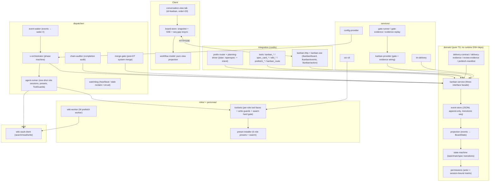

# dsh-swarm

[简体中文](README.zh-CN.md) · [English](README.md)

---

**Say one requirement, reply one confirmation — six specialist agents take it from planning to verified delivery. No commands to memorize.**

dsh-swarm is a DSH plugin that turns one requirement into a strict, evidence-verified delivery pipeline. An orchestrator (V) decomposes an approved spec into a strictly ordered phase chain (`p → (pt?) → w2 → d → dt → w3 → summary`); six single-purpose roles (V / P / W / D / PT / DT) run each phase with isolated, permission-gated tool faces; every handoff is machine-verified against an evidence contract; failures recover through idempotent retry and human-gated reviews; and a live Workflow kanban tab streams all state to the browser via SSE. Design inspired by the [Hermes Agent kanban](https://github.com/NousResearch/hermes-agent).


---

## Swarm mode (recommended)

Swarm mode turns your main session into a **team lead**: **you state the requirement, it clarifies, plans, confirms, delegates and follows through** — entirely in natural language, no commands to remember.

- **No commands to memorize** — just state your requirement; no `/plan:` or `/openspec:` prefixes needed.
- **Automatic intent recognition** — development requests → clarify/plan and build a chain; lessons & retrospectives → persist to memory; group notifications → deliver to WeCom; Q&A / chit-chat → answered directly. Intent is judged by the model, not by a code-level classifier — the confirmation gate below is what stops a misjudged chain.
- **Free delivery** — `/sms <intent>` (e.g. "post current progress to the group"): facts are grounded via kanban lookup, then the body is composed per intent and delivered; `-s` or wording like "private chat" targets the DM. A bare `/sms` re-sends the latest completed-chain report and `/sms blocked [chainId]` the block notice — those two bodies are rendered by system code from kanban facts, never rewritten by the lead. Group and private-chat targets auto-resolve to the single saved target (0 or 2+ targets error out; clean up in dsh-im settings, or pin `imDelivery.targetId` / `imDelivery.dmTargetId`, which skips the count check — though with `imDelivery.botId` empty the pinned target must still belong to the auto-discovered bot, or it errors out).
- **Confirmation gate against accidental chains** — after the checklist is saved, the lead is instructed to build a chain only once you reply with an explicit affirmative (`确认` / `开干` / `开跑` / `开始` / `go`, etc.). The gate is judged by the model, not enforced by a code-level check; vague replies, topic switches, or edit-only feedback count as *not confirmed*.
- **The lead is read-only** — the main session cannot write/edit repo sources, nor run git mutations (push/commit/reset…); a bare `git checkout`/`git switch` of an existing branch is allowed. Writing code is done by the executor (D) in an isolated workspace by design.
- **Progress is always actually queried** — ask "how is it going?" anytime and the lead reports from real kanban lookups, never fabricated.

### Why it's designed this way

Coordinating several agents on one task typically fails in three ways:

- **Role drift** — the "planner" starts writing code, the "executor" reviews its own work, and nobody owns the outcome.
- **Unverifiable handoffs** — an agent claims "done" with no reproducible evidence, and the next agent builds on sand.
- **Silent deadlocks** — an agent stops without finishing and the pipeline hangs, or bad code is merged before anyone reviewed it.

dsh-swarm encodes a *contract* against all three: one responsibility per role, enforced by the permission matrix, tool faces and task-body instructions;
every handoff must carry structured evidence or the phase will not close; every stall or review
failure lands in a visible, recoverable state — with you (the human) as the final trust anchor.
It is built correctness-first: deterministic state machines, append-only event sourcing, idempotent
schedulers, and a red-team test suite that replays the event log and rejects any illegal transition
(mechanics in [Advanced](#advanced--developers)).

### Two modes

| Mode | How you use it | Notes |
|---|---|---|
| **Swarm mode** (recommended) | Just say the requirement in natural language | No commands to memorize, intent auto-recognized, runs on confirmation |
| **Command mode** (compatible) | `/plan: <requirement>` → clarify → `/openspec: confirm` | Kept for compatibility, functionally equivalent; may be removed in the future — new users should use swarm mode |

---

## Quickstart

### 1. Install

Prerequisites: a working DSH runtime (`@deepseek-ai/*`), Node.js ≥ 22.19 and npm. Optional: a wiki-vault HTTP service (KB features, see [Configuration](#configuration)).

From npm (the published tarball ships the built `lib/`):

```bash
dsh plugin --profile web add @joekytc/dsh-swarm
```

From a source checkout (rebuild first so `lib/` matches the sources):

```bash
npm install
npm run build        # tsc -p tsconfig.build.json + client bundle (lib/client.js)
dsh plugin --profile web add .
```

> From GitHub source: `dsh plugin --profile web add github:joekytc/dsh-swarm` — the repository tracks the built `lib/`.

### 2. Switch your main-session preset

Switch the main session's agent preset to **Swarm (蜂群模式)** — it is installed at `$DSH_HOME/.agent-presets/swarm` once the plugin is installed.

### 3. Say → confirm → watch progress

Example conversation:

```
You: Add a role-management page to the admin project with CRUD and permission checkboxes

Lead: Let me confirm a few things first —
  · Which role fields do you need (name/description/status/…)?
  · Permission source: the existing menu tree, or custom?
  · Any acceptance requirements, e.g. "deleting a role must not affect linked users"?

You: Fields are name and description, permissions from the existing menu tree, acceptance via TDD

Lead: Checklist saved (six spec sections + repo facts). Reply "confirm" to launch —
      I'll spin up the p → (pt) → w2 → d → dt → w3 pipeline.

You: confirm

Lead: Chain created (ch_…), live progress on the kanban tab (Conversation → Trajectory → Kanban).
      First phase: Planning (P)…
```

- **Kanban**: the third tab of the conversation center (Conversation → Trajectory → Kanban). Click a card for Overview / Trajectory / Handoff / Spec / Comments.
- **Completion**: when a chain completes, the system audits the workspace and (for D chains) automatically merges the feature branch into the spec-declared target branch. An audit warning blocks the final wrap-up until you confirm ownership in the GUI — it does not gate the merge.
- **Progress**: just ask "how is it going?" — the lead reports from real kanban lookups and relays blocking reasons faithfully.

---

## What it does for you

Six roles, one job each — boundaries enforced by the permission matrix, trimmed tool faces and task-body instructions, so no role creep:

| Role | One-line responsibility | What it never does |
|---|---|---|
| **V** Orchestrator | Creates phase cards, drives the pipeline, gives guidance on stalls | Never executes |
| **P** Planner | Reads the spec + repo facts, writes the implementation plan | Never writes code |
| **PT** Plan reviewer | Read-only review of P's plan (on demand) | Never changes anything |
| **W** Knowledge officer | Syncs the KB in planning/completion phases | Never touches code/git |
| **D** Executor | The only role that writes code: implement → verify → commit → push feature branch | Never merges into the target branch itself |
| **DT** Implementation reviewer | Empirically verifies D's delivery (tests/build/typecheck/diff) | Read-only against the repo |

The pipeline (strictly serial within a chain, parallel across chains):

```text
p ──> (pt?) ──> w2 ──> d ──> dt ──> w3 ──> summary
plan   plan rev.  KB    impl  impl rev.  KB    wrap-up
```

- `pt` appears only when P decides a plan review is needed; `d` is **always** followed by an implementation review (`dt`).
- Chain completion is decided by a mechanical rule (W3 done + D done with delivery evidence + no open tasks), not by an agent's self-assessment.

---

## Configuration

All keys are optional; schema lives in `src/config.ts`. **Most users only need the first three** — keep the rest at their defaults.

The 「模型链」 (model chain) card in the config panel: **every role gets its own model** — pick provider, model and reasoning effort per role; roles you leave untouched show 「继承」 (inherit) and follow the default.


| Key | Default | Description |
|---|---|---|
| `storageDir` | `$DSH_HOME/storages/kanban` | Event log (`events.jsonl`), orchestration state, per-task workspaces, `dispatcher.log`. Value must use the unquoted `!!js dshHomePath("storages/kanban")` form — quoting degrades it into a literal string |
| `wikiVault.baseUrl` | `''` (empty) | wiki-vault HTTP service for KB reads/writes — required for KB features; set to your own server |
| `wikiVault.pagePrefix` | `projects/` | Namespace prefix for generated wiki pages |
| `roles.models.<role>` | `{}` | Per-role model: `{ provider, model, reasoningEffort?, fallbacks?[] }` |
| `roles.models.<role>.reasoningEffort` | `high` | Default reasoning effort for all roles |
| `roles.models.<role>.fallbacks` | `[]` | Silent fallback candidates (audited via `[model-fallback]` comment) |
| `dispatcher.staleTimeoutSeconds` | `14400` | Heartbeat timeout; running task without heartbeat is reclaimed |
| `dispatcher.maxRetries` | `3` | Failure retries before circuit → `blocked(gave_up)` |
| `dispatcher.heartbeatIntervalSeconds` | `300` | Watchdog heartbeat period |
| `dispatcher.maxProtocolViolations` | `2` | Protocol-violation guardrail: once consecutive violations reach this many, the next one is final (`gave_up`) |
| `dispatcher.maxReworksPerRole` | `{ pt: 3, dt: 3 }` | Max review rework rounds before `review/gave-up` + `[review-final]` |
| `prefixRoutes.plan` | `/plan:` | Command-mode phase-0 planning prefix |
| `prefixRoutes.openspec` | `/openspec:` | Command-mode approve-and-execute prefix |
| `prefixRoutes.learning` | `/learning` | Lessons / retrospective prefix |
| `prefixRoutes.send` | `/sms` | Free-delivery prefix (DM with `-s`) |
| `memory.enabled` | `true` | Memory recall index; `false` makes `planning_memory_recall` return a disabled notice |
| `memory.maxIndexEntries` | `8` | Max recalled memory entries (1–20) |
| `ui.enabled` | `true` | Declared switch; not consumed yet — the tab registers unconditionally |
| `ui.contentMinWidth` | `715` | Declared lower width bound (px); not consumed by the client yet — the tab follows the host conversation width |
| `ui.contentMaxWidth` | `780` | Declared upper width bound (px); not consumed by the client yet |
| `ui.sseHeartbeatSeconds` | `20` | SSE heartbeat interval |
| `gates.enabled` | `true` | TDD measurement gate; `false` → silent skip (no event) |
| `gates.timeoutMs` | `600000` | Per-command gate timeout (ms), SIGKILL at the deadline |
| `gates.forbidden` | `['rm -rf /', 'git push']` | Command-blacklist substrings (defence in depth) |
| `evidenceReplay.enabled` | `false` | L3 replay of model-written commands — not a sandbox, see [Issue evidence check](#issue-evidence-check-pr2-opt-in) |
| `evidenceReplay.timeoutMs` | `600000` | Per-replay command timeout (ms) |
| `evidenceReplay.allowPrefixes` | `['npx --no-install vitest', 'npm test', 'npm run build', 'npm run typecheck', 'tsc', 'eslint']` | Allowlisted tool prefixes (word-boundary match) |
| `imDelivery.enabled` | `false` | WeCom delivery via dsh-im (W3 wrap-up / chain blocked / review gave-up) |
| `imDelivery.botId` | `''` | Empty = auto-discover the only wecom bot |
| `imDelivery.targetId` | `''` | Empty = auto-discover the only saved group target |
| `imDelivery.dmTargetId` | `''` | DM target for `/sms -s` |
| `imDelivery.fallbackBotId` | `''` | Bot used when preset-based matching finds nothing |
| `reviewEngine.mode` | `delegate` | `delegate` or `managed` — see [Review engine (ocr)](#review-engine-ocr) |
| `reviewEngine.managed.provider` | `''` | Model-chain provider id used in managed mode |
| `reviewEngine.managed.model` | `''` | Model-chain model id used in managed mode |
| `wikiWritePresets` | `['swarm', 'kanban-w', 'ptc']` | Presets allowed to call `wiki_write` (page paths are still whitelisted by namespace) |

---

## Review engine (ocr)

Implementation reviews (the in-chain DT phase and standalone reviews) are powered by
[open-code-review](https://open-codereview.ai) (ocr), with two modes switchable in the
web config panel under 「Swarm 配置 → 评审引擎（ocr）」 (Swarm config → Review engine (ocr)):

| Mode | How it works | Notes |
|---|---|---|
| **Delegate** (default) | ocr only outputs the review scope and rules; DT reviews each file with its own model | Zero API keys, works out of the box |
| **Managed** | ocr runs the full review with your chosen provider/model and returns normalized findings in one shot | For large change sets; delegate mode hints at switching past 50 files (a hint only, never auto-switched) |

The 「评审引擎（ocr）」 (review engine) card in the config panel: with ocr installed, choose the mode (managed / delegate) plus provider and model, then click 「应用到 ocr」 (Apply to ocr) to wire it up.


### Install

- When ocr is missing, the config panel shows a red banner — click 「安装 ocr」 (Install ocr) for a one-click global install (async, cancellable);
- or run `npm install -g @alibaba-group/open-code-review` in a terminal, then verify with `ocr --version`.

### Standalone review (no chain needed)

1. Switch the session to 「交付评审官（DT）」 (Delivery Reviewer (DT)) at the top of the dsh web UI and just talk;
2. State the review target: a local directory / branch range (from…to) / a single commit / uncommitted workspace diff / a public repo URL (auto-cloned into a temp dir, discarded afterwards);
3. The report is first fully output to the conversation;
4. Only after you confirm is it written to the KB at `projects/<repo>/reviews/<topic>-<date>/` — remote KB mode only; with the default empty `wikiVault.baseUrl` (local mode) no wiki page is written.

Read-only in practice: bash/run_code writes and wiki writes outside the reviews namespace are blocked by the guard, while the fs `write`/`edit` tools are not blocked in a standalone DT session.

### Configuration notes

- Mode, provider and model are all chosen on the 「评审引擎（ocr）」 card; the provider/model dropdowns share the same catalog as the model chain;
- After picking, click 「应用到 ocr」 (Apply to ocr) — the system writes the wiring into ocr's custom config (`dsh-managed`); the API key is resolved from the dsh model config and written into ocr, never shown in plain text in the panel; if resolution fails it degrades gracefully and points you to a manual `ocr config provider` in a terminal;
- When managed is not ready, the ocr tool refuses the managed call and returns delegate guidance; the reviewer switches to delegate mode — nothing is blocked.

Official docs: [Installation](https://open-codereview.ai/docs/installation) · [Model configuration](https://open-codereview.ai/docs/configuration) · [Delegate mode](https://open-codereview.ai/docs/delegate)

---

## Trust & guardrails (user's view)

- **Read-only hard gate for the lead** — in swarm mode, main-session writes to sources and git mutations are blocked by a system gate; if blocked, just let the lead explain — execution is done by the D role.
- **Confirmation gate** — the lead only builds a chain after you reply with an explicit affirmative (enforced by the lead's instructions, not by a code-level check).
- **TDD hard gate** — implementations must ship with tests (or an explained skip); reviews machine-verify "tests really ran, and were written first".
- **Human trust anchors** — spec approval, unblock, audit confirmation and chain deletion are human-only; role agents cannot approve specs, and a chain is only created from your confirmed routing call (the main session routes as `human`).
- **Guardrails are constraints, not a sandbox** — PT/DT write guards rely on path and command regexes (reviewers get no git credentials), and review evidence is existence-checked: fields must be present and well-formed, while replaying the commands to prove they ran happens only when `evidenceReplay.enabled` is turned on.
- Full mechanics (permission matrix, delivery contract, review chain, rework, failure recovery) live under [Advanced / Developers](#advanced--developers).

---

## Advanced / Developers

> Mechanics and implementation details below — regular users can skip.

### Roles & the execution pipeline (full table)

Six roles are dispatched by the scheduler as one-shot agent sessions (deterministic session id `kbn-<taskId>`; a retry resumes that same session — `resumeSessionId` is always null in the current implementation — while a rework task starts its own `kbn-<reworkId>` session). Each role-agent session is bound to exactly one task (`boundTaskId`) and gets a trimmed tool face. V is the exception: a chain-scoped orchestrator session (`kbn-v-<chainId>`) with no `boundTaskId`.

| Role | Alias | Responsibility | Tool face (highlights) |
|---|---|---|---|
| **V** | Orchestrator | Drives the phase machine, creates one card per phase, posts `[blocked-review]` guidance on stalls. Never executes. | `kanban_create` + task tools + spec view |
| **P** | Planner | Reads spec + repo facts (incl. read-only self-checks), writes an OpenSpec implementation plan, opts into PT via `pt_decision.needed`. Never executes. | Task tools + spec view, read-only (writes only `openspec/changes/`) |
| **PT** | Plan reviewer | Read-only review of P's plan (requirements alignment, completeness, logic). Outputs verdict + issues. | Task tools + spec view, **read-only ToolGuard** |
| **W** | Knowledge officer | W2/W3 KB sync (`w:kb`). Never touches code/git. | Task tools + `wiki_search/read/write` (remote) / `skill`→llm-wiki (local) + `prefetch_file`/`prefetch_external`/`prefetch_kb` + read-only spec view |
| **D** | Executor | The *only* role that writes code: worktree → implement → verify → `[AI-GEN]` commit → push feature branch (merging into the spec-declared target branch is done by the system only after DT passes). | Task tools + wiki read + bash/fs/run_code (full dev) + subagent (spawn/fork/list-agents) + goal |
| **DT** | Implementation reviewer | Empirically verifies D's work (test/build/typecheck/diff/git + open-code-review), writes review page to KB. Read-only against the repo. | Task tools + wiki read/write (review namespace) + `ocr_review` + bash/fs/run_code, **read-only ToolGuard** |

### Guardrails in detail

#### Permission matrix

`can(action, actor, task, { boundTaskId })` in `src/domain/permissions.ts`.
"Bound" means the actor is the role agent session spawned for *that exact task*
(`boundTaskId === task.id` and, for `complete`, also `actor === task.assignee`).

| Action | V | P | W | D | PT | DT | Human | System |
|---|---|---|---|---|---|---|---|---|
| create-chain / create-task | ✅ | ❌ | ❌ | ❌ | ❌ | ❌ | ✅ | ❌ |
| claim | ❌ | ❌ | ❌ | ❌ | ❌ | ❌ | ❌ | ✅ |
| complete | ❌ | bound | bound | bound | bound | bound | ✅ (GUI) | ✅ |
| block | ❌ | bound | bound | bound | bound | bound | ✅ | ✅ |
| heartbeat | ❌ | bound | bound | bound | bound | bound | ❌ | ❌ |
| comment | ✅ | ✅ | ✅ | ✅ | ✅ | ✅ | ✅ | ✅ |
| unblock | ❌ | ❌ | ❌ | ❌ | ❌ | ❌ | ✅ | ❌ |
| archive | ✅ | ❌ | ❌ | ❌ | ❌ | ❌ | ✅ | ❌ |
| spec-approve | ❌ | ❌ | ❌ | ❌ | ❌ | ❌ | ✅ | ❌ |
| spec-edit | ❌ | ❌ | ❌ | ❌ | ❌ | ❌ | ✅ | ❌ |
| spec-attach | ✅ | ❌ | ❌ | ❌ | ❌ | ❌ | ✅ | ❌ |
| update-title | ❌ | ❌ | ❌ | ❌ | ❌ | ❌ | ✅ | ❌ |
| delete-chain | ❌ | ❌ | ❌ | ❌ | ❌ | ❌ | ✅ | ❌ |
| wiki-write | ❌ | ❌ | ✅ | ❌ | ❌ | ✅ (review ns) | ❌ | ❌ |
| wiki-read | ❌ | ❌ | ✅ | ✅ | ❌ | ✅ | ❌ | ❌ |
| prefetch | ❌ | ❌ | ✅ | ❌ | ❌ | ❌ | ❌ | ❌ |
| audit-confirm | ❌ | ❌ | ❌ | ❌ | ❌ | ❌ | ✅ | ❌ |
| create-rework-task | ❌ | ❌ | ❌ | ❌ | ❌ | ❌ | ❌ | ✅ |
| reopen-chain | ❌ | ❌ | ❌ | ❌ | ❌ | ❌ | ✅ | ❌ |
| waive-review | ❌ | ❌ | ❌ | ❌ | ❌ | ❌ | ✅ | ❌ |

Key guarantees (two):

- **The main session cannot execute.** Its kanban tool face is a read-only subset —
  `kanban_show`/`kanban_chain`/`kanban_list`/`kanban_comment` plus the human-recovery pair
  `kanban_reopen_chain`/`kanban_waive_review` — together with `spec_card_view`, `kanban_route`,
  the `planning_*` tools and `sms_send`; never `kanban_create`/`kanban_complete`/`kanban_block`.
  Chains/specs are created only via swarm-mode intents or `/plan:`+`/openspec:`; the GUI observes
  and mutates task state but never creates chains or tasks — "who decided to run what" stays
  explicit and auditable.
- **Session binding prevents cross-task escalation** (a W agent bound to task A
  cannot complete/block task B even though both are W tasks); DT writes are
  confined to the `projects/<repoSlug>/<chain>/review/` namespace by a ToolGuard on top of
  the matrix; and no role agent can approve specs, unblock, confirm audits, waive a
  review or reopen a chain — those are human trust anchors; `system` handles only
  mechanical bookkeeping.

#### Delivery contract (upstream owes downstream)

Each phase's handoff must carry the keys its downstream actually reads
(`src/domain/delivery-contract.ts`). Missing delivery keys block the W/P card
immediately and admit no human exemption; the D/PT/DT evidence gates instead reject
`complete` with an error (the card stays running) and are human-exempt. The
orchestrator never builds a downstream card on a blocked parent:

| Card | Required handoff keys |
|---|---|
| W2 / W3 (`w:kb`) | `kb_url` + `page_path` — non-empty is not enough: with a configured `wikiVault.baseUrl` the `kb_url` must start with it (and must be exactly `''` in local mode), while `page_path` must sit in the allowlisted namespaces (`wiki/**` locally) |
| P (`p:openspec`) | `artifacts_path` + `pt_decision` (`needed` boolean required; when `needed: true`, `reason` is required) |
| D (`d:execute`) | `changed_files` + (`commit_hash` or `push`) — `hasDeliveryEvidence`; `branch` (feature branch) is not a delivery key, but when the TDD gate actually runs the tests it checks the branch and bounces the card if it is absent or mismatched; `tdd` (`test_files` or `skipped.reason`, XOR) |
| PT / DT | `review_evidence` (schema-valid) — `validateReviewEvidence` |

#### TDD hard gate (evidence threshold)

D completes only with `tdd` — `test_files` (with `test_first`) or `skipped.reason`
(XOR, `delivery-evidence.ts`). DT's `review_evidence` must carry `tdd`; whenever
`tdd.test_files` are declared the runner must be `vitest` (`test.runner`), and on a
`pass` verdict `test_first === true` must hold (`review-evidence.ts`). This makes
"tests actually ran, and were written first" a machine-checked property rather than
a claim.

#### Gate skip alarm & declaration cross-check 

A declaration that disagrees with the diff no longer passes the gate silently
(three silent-skip modes remain, emitting no event: `gates.enabled=false`, a handoff
without `worktree_dir`, and non-`d:execute` cards):

- **`task/gate-skipped` event** — a declared `tdd.skipped` is allowed when the diff is pure docs/config, or when the diff cannot be computed (conservative alarm-skip); both leave the event as an audit trail. Otherwise the gate **bounces** the card back (same session, agent fixes and re-completes).
- **Declaration ↔ reality cross-check** — declaring `test_files` with no test-file change in the diff (stale-test handoff), an empty `test_files`, an invalid path, or a branch mismatch all **bounce** instead of silently skipping.
- After 3 cumulative bounces the task is **blocked for human review** (`gave_up: gate bounced 3 times`).
- Gate runs now archive raw output to `<storageDir>/gate-logs/<taskId>.log` (path is referenced in the gate event detail).
- `review_evidence.lint` must be a structured object (aligning with `build`/`typecheck`); `null`/scalars are rejected.

#### Issue evidence check (PR2, opt-in)

Reviewer-reported issues (DT cards only — PT issues are never evidence-checked) can carry `evidence = { file, command, exit }` (raw output archive, first line `[exit code: N]`). Verification is three-tier: missing evidence → flagged (`not-provided`; critical/high → `could-not-replay` + needs-human); archive paper-check (zero execution) → `matches`; on mismatch a **replay** re-runs the command — **only if `evidenceReplay.enabled` is turned on**, and only for allowlisted tool prefixes (word-boundary match; `npm run` restricted to fixed script names). Replays execute model-written commands and are **NOT a sandbox**; keep the switch off unless you accept that risk. Results are summarized in a `review/evidence-check` event; `differs` never auto-fails a review — it surfaces to human review.

#### Phase-0 planning checklist

Planning runs a read-only planning session (`grill-me` → `planning_prefetch` →
`planning_checklist_save`, `planning-driver.ts`). The checklist carries a structured
manifest (repo facts + file baseline, `prefetch-manifest.ts`); an invalid manifest
blocks the save, and chain creation mounts the checklist as the `file-prefetch` +
`kb` attachments on the spec card (`prefix-router.ts`).

#### Review quality chain

- After **P** completes, **PT** is skipped only when P's handoff delivers
  `pt_decision.needed = false`; `true` or an absent decision creates the PT card
  (fail-safe) — the orchestrator never overrides the decision (V only creates the card).
- After **D** completes, a **DT** card is *always* created.
- **PT/DT are read-only**: a ToolGuard mechanically denies writes to the repo
  sources, git mutations, and (for DT) wiki writes outside the review namespace.
- **DT** review engine: `open-code-review` (ocr, dual mode: delegate/managed, see
  [Review engine (ocr)](#review-engine-ocr)); a pre-start probe blocks
  `review-tool-unavailable` when ocr is missing (reason notes GUI install),
  without burning retries.
- `review_evidence` must pass `validateReviewEvidence` or the review card cannot
  complete: PT needs verdict + issues + plan ref, and a `fail` verdict requires at
  least one unresolved `critical`/`high` issue (otherwise it must be `pass`); DT
  additionally needs test (exit 0 on pass), build/typecheck, lint, non-empty diff,
  git, ocr/fallback conclusion, and `tdd`.

#### Rework (review failure)

A failed review never mutates a `done` card. Instead the system records
`review/failed`, creates a **rework task** (`[返工] ...`) with its own session
(`kbn-<reworkId>`, `resumeSessionId = null`), `reviewAttempt + 1`, and starts as
`todo` (`reviewStatus: 'pending'`). The rework card body additionally carries the
previous round's issues verbatim in a `## 本轮修复清单` (fix-this-round) section.
A fresh review card is then dispatched for the rework.
When `reviewAttempt` reaches `maxReworksPerRole` (PT 3 / DT 3), the system records
`review/gave-up` and posts a `[review-final]` evidence-chain comment (the same marker
is reused by the convergence-gate downgrade below), and (with IM
delivery enabled) sends a `[评审超限待裁决]` notification with two exit paths:
waive the review (`kanban_waive_review` / GUI “豁免评审”) or reopen the chain
(`kanban_reopen_chain` / GUI “人工恢复”). **Convergence gate**: on PT
rework rounds, once all legacy issues are resolved and no unresolved `critical`
remains, a `fail` verdict is downgraded to `pass` (new findings flow downstream as
non-blocking suggestions), so the loop always converges.

#### Failure recovery

Two orthogonal failure paths, both human-recoverable:

- **Protocol violation** (agent idle without `complete`/`block`): role agent →
  `blocked(protocol_violation)` → V posts idempotent `[blocked-review]` guidance →
  human unblocks → same-session resume (NOT a fresh start). After
  `maxProtocolViolations` (2) recoverable cycles, the next violation →
  `blocked(gave_up)` + system posts `[blocked-final]` evidence chain (block
  timeline + review/comment timeline + final reason).
- **Hard failures & circuit**: `task/failed` increments `attempts`; the dispatcher
  re-dispatches (same-session resume) while `attempts < maxRetries`, then circuits
  to `blocked(gave_up: max retries)`. The watchdog reclaims `running` tasks that
  stop heartbeating after `staleTimeoutSeconds` (heartbeats are a *status* signal,
  never a business mutation; SSE heartbeats never carry board state). Per-role
  model candidates (primary + fallbacks, `reasoningEffort: high` default) fall
  back silently (audited via `[model-fallback]` comment); if *all* candidates fail
  it blocks `model-unavailable` for the human. A single hanging V wake cannot
  stall the scheduler — V wakes are wrapped in a 60 s timeout (role-task dispatch
  still awaits the session's `whenIdle`).

#### Chain completion: audit gate + merge gate

When the mechanical chain-complete rule fires, two gates run in the
`chain/completed` hook:

1. **Completion audit gate**: the `ChainAuditor` scans live non-role sessions for
   write-capable tool calls aimed at the chain workspace (`kanban-*` preset subagents
   exempt), then reconciles artifact ownership as a mechanical fallback. Orphaned
   writes emit `chain/audit-warning`; the UI shows a warning banner and blocks the
   final summary until the human confirms ownership (`chain/audit-confirmed`, human-only).
2. **Merge gate (post-DT system merge)**: D never merges to the target branch and
   never pushes it — it only commits to (and optionally pushes) its feature branch,
   carrying `branch` in its handoff. The target branch is the one declared in the
   spec (written by V into the D task body). After DT approves and the chain
   completes, `merge-gate.ts` performs, as `system`: `git checkout <target-branch>
   → git merge --no-ff <feature-branch> → git push`. Outcomes are recorded as
   idempotent comments: `[merge-done]` (with hash), `[merge-skip]` (merge input
   unresolvable), or `[merge-failed]` (checkout/merge/push failed, e.g. a conflict).
   Failures never throw — the gate only records `[merge-failed]`; note that a failed
   push can leave the target branch already merged locally, and a conflicting merge
   leaves the worktree mid-merge. Repairing is a human job.

### Event sourcing & domain model

Every state change is appended to `<storageDir>/events.jsonl`, one JSON event per
line. The `seq` is assigned by the store (re-read from the file tail on every append
as the last line's `seq` + 1) — append-only, except that a human chain delete purges
that chain's lines and renumbers the remaining `seq` values. The **trajectory is the
event log itself**; restart replays it to rebuild the board.

```jsonc
// one line in events.jsonl
{ "seq": 12, "chainId": "ch_x_...", "taskId": "t_y_...",
  "kind": "task/completed",
  "payload": { "summary": "...", "metadata": { /* handoff evidence */ }, "completedAt": 1760000000000 },
  "author": "w", "at": 1760000000000 }
```

Event families actually emitted: `chain/*` (created, executing, completed, blocked,
reopened, root-task-set, audit-warning, audit-confirmed, title-updated,
im-delivery-failed), `spec-card/*` (created, edited, approved), `task/*` (created,
claimed, heartbeat, commented, completed, blocked, unblocked, failed, archived,
renamed, gate-passed, gate-failed, gate-skipped), and `review/*` (passed, failed,
gave-up, waived, evidence-check).

Replay is **strict**: the projection replays every transition event through the state
machine and throws on any illegal transition, so a corrupted or tampered log fails
loudly instead of silently producing an inconsistent board (non-transition kinds such
as `task/commented` are recorded as no-ops). Covered by
`tests/redteam/anti-escalation.test.ts` and `tests/domain/projection.test.ts`.

The service emits events through a serialized queue (append-then-publish), and
subscribers (SSE) receive every event exactly once in order. UI and dispatcher both
consume the same persisted events — there is no secondary source of truth.

### Web client (Workflow kanban tab)

A browser-half React tab registered into `conversation.view` (`id=kanban`,
`order=20`, so it sits after Conversation and Trajectory). It registers **no
shell-level overlays, sidebars, or detail panes**.

- **Data path**: initial snapshot (`GET /kanban/board`) → SSE stream
  (`GET /kanban/events?after=<seq>`) → board-store applies events incrementally,
  deduplicates by `seq`, and re-pulls the full snapshot on any gap. **No business
  polling.**
- **Layout**: multi-chain vertical rails; the width follows the host conversation
  width (`--dsh-chat-content-width`, 780 px fallback), full height; the active chain
  is expanded, blocked chains always show a warning summary. In-page rename/delete use
  a lightweight modal (no shell overlays); no drag-and-drop, no width memory.
- **Cards**: compact two-line cards with profile-colored nodes; status lines are
  green solid (done) / blue solid (current) / gray dashed (pending) / red broken
  (blocked).
- **Detail drawer**: five sections — Overview / Trajectory / Handoff / Spec /
  Comments; `Esc` or back returns to the list.
- **Actions** (`POST /kanban/action`): block / unblock / retry / complete /
  archive / comment / `waive-review`, plus chain-level `confirm-audit`, `rename`
  (chain or task), `reopen-chain` and `delete` (chain, human-only, double-confirmed in
  the GUI). Status actions (block / unblock / complete / archive / retry) apply
  optimistic updates with rollback; the rest wait for the server event, and the store
  re-pulls the authoritative snapshot on any divergence.
- **Build**: `npm run build:client` produces `lib/client.js` in the
  `window.__ModuleLoader__.load()` format (identical convention to `dsh-client-*`).
  Adding dsh-swarm to a web profile auto-embeds it into `__DSH_BOOT__`.

### Architecture

Layers, with the domain layer kept free of **runtime** DSH dependencies (a single
type-only import of `ObjectJsonSchema` in `prefetch-manifest.ts`) so it can be fully
unit-tested and replayed in isolation.



#### Layer responsibilities

- **Domain** (`src/domain/`) — the entire business model as pure TypeScript:
  event store, state machines, projection, permission matrix, delivery/review/
  manifest validators, and the `KanbanService` facade that routes every write from
  tools, CLI, and UI through one authority. Extensively unit-tested.
- **Integration** (`src/tools/`, `src/routes/`) — cordis tools and routes:
  the role tool faces, main-session tools (`kanban_route` + read-only subset), and
  the `/kanban/*` HTTP/SSE bridge.
- **Services** (`src/services/`) — provider wiring (`kanban-provider` installs the gate
  and evidence-check hooks), the gate runner / evidence replay, `ocr-cli`, IM delivery
  and the config provider; the scheduler itself (`src/dispatcher/dispatcher.ts`)
  belongs to the Dispatcher layer.
- **Dispatcher** (`src/dispatcher/`) — event wake, phase orchestration, one-shot
  agent runner (persona preset mounting, model candidate chain, ToolGuard
  installation), watchdog, chain auditor, and merge gate.
- **Roles** (`src/roles/`, `personas/`) — trimmed agent presets installed into
  `$DSH_HOME/.agent-presets/` (including the swarm preset), per-role tool
  assembly, write-guard logic, and the swarm-session hard gate.
- **Wiki** (`src/wiki/`) — thin HTTP client for wiki-vault.

### Development

Quality gates (see `AGENTS.md`):

```bash
npm run typecheck   # tsc -p tsconfig.json --noEmit  (0 errors)
npm test            # vitest run  (all green)
npm run build       # tsc -p tsconfig.build.json + build:client (lib/client.js)
```

GUI verification (only when a dsh web instance is already running on port 3080;
do **not** start a second instance):

```bash
python tests/e2e/gui-check.py --url http://127.0.0.1:3080/
```

> Deploying to a running DSH instance requires a plugin reload/restart; building
> alone does not hot-reload the running plugin.

---

## License

[MIT](LICENSE)
