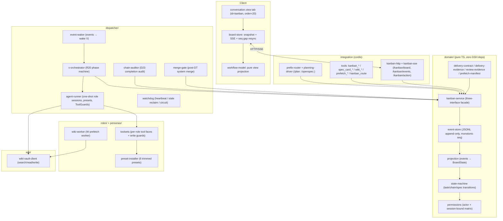

# dsh-kanban

[English](README.md) · [简体中文](README.zh-CN.md)

---

**面向 DSH（DeepSeek Harness）的多角色、事件溯源任务看板。**

dsh-kanban 把一个单次规划会话，变成一个受约束、可观测的执行管线：编排者（V）把已批准的规格拆成严格有序的相位链，六个单一职责的角色 agent（V / P / W / D / PT / DT）以**隔离的工具面**执行每个相位；每份交付都经过**针对证据契约的机器校验**；故障通过**幂等重试与人工把关的评审**恢复；一个实时 Workflow 看板标签页通过 SSE 把整个状态流式同步到浏览器。


---

## 目录

- [为什么](#为什么)
- [核心思想](#核心思想)
- [角色与执行管线](#角色与执行管线)
- [快速开始](#快速开始)
- [配置](#配置)
- [架构](#架构)
- [事件溯源与领域模型](#事件溯源与领域模型)
- [权限矩阵](#权限矩阵)
- [交付契约与评审质量链](#交付契约与评审质量链)
- [故障恢复与护栏](#故障恢复与护栏)
- [链路完成：审计闸门 + 合并闸门](#链路完成审计闸门--合并闸门)
- [Web 客户端（Workflow 看板标签页）](#web-客户端workflow-看板标签页)
- [项目结构](#项目结构)
- [开发](#开发)
- [路线图](#路线图)
- [已知限制](#已知限制)
- [FAQ](#faq)
- [许可证](#许可证)

---

## 为什么

在单一任务上协调多个 AI agent，通常以三种方式失败：

1. **角色漂移** ——"规划者"开始写代码，"执行者"开始评审自己的工作，没有人对结果负责。
2. **不可验证的交接** ——agent 声称"完成"，却没有可复现的证据，下游在流沙上继续建设。
3. **静默死锁** ——agent 中途停住不再推进，管线挂起；或坏代码在任何人评审之前就被合并。

dsh-kanban 针对以上三种问题编码了*契约*：每个角色只有一项由机器强制的职责；每次交接必须携带结构化证据，否则相位无法关闭；每次停滞或评审失败都会落入可见、可恢复的状态，并以**人类作为信任锚**。

它被构建为**正确性优先**：确定性状态机、只追加的事件溯源、幂等调度器，以及一套红队测试套件——重放事件日志并拒绝任何非法转换。

---

## 核心思想

| 思想 | 在代码中的含义 |
|---|---|
| **每个角色单一职责** | V 只编排、P 只规划、PT 只评审计划、W 只做知识库桥接、D 只执行、DT 只验证并评审实现。硬编码为编排器中的 `R20_PHASE_ORDER`。 |
| **证据门槛交付** | 任务缺少必需交接键就不能完成（`delivery-contract.ts`）；D 必须携带 git 产物（`delivery-evidence.ts`）；PT/DT 必须携带 schema 合法的评审载荷（`review-evidence.ts`）。仅有人类强制完成绕过 D 与 PT/DT 的证据闸门；W/P 交付键、manifest 校验与链关闭闸门仍适用。 |
| **结构性防越权** | 权限矩阵（`permissions.ts`）按 actor 与会话绑定（`boundTaskId`）双重限定；角色裁剪的 agent preset（`personas/kanban-<role>/agent.cordis.yml`）；评审者只读 ToolGuard。主会话被*禁止*直接创建执行任务——只经 `/plan:`/`/openspec:` 路由；GUI 只观察与变更任务状态，从不建链/建任务。 |
| **事件溯源** | 每次变更都追加到 JSONL 事件日志。看板状态是投影；重启回放日志重建；"轨迹"标签页*就是*日志本身。回放强制执行状态机，日志损坏会响亮失败（红队测试）。 |
| **确定性系统推进** | 链路推进不是因为 agent *觉得*该推进。编排器逐相位建卡，调度器在事件到来时唤醒它，链路由机械规则标记完成（末相位 W3 + D 证据 + 无未完成任务）。 |
| **反脆弱** | 协议违规检测（空闲却未 `complete`/`block`）、心跳看门狗 + 过期回收、失败熔断（`maxRetries` → `blocked(gave_up)`）、评审返工护栏（`maxReworksPerRole`）、证据链评论（`[blocked-final]`、`[review-final]`）给人类完整时间线。 |
| **人类作为信任锚** | 解除阻塞、规格批准/编辑、审计确认、强制完成均仅限人类。角色 agent 绝不自行决定合并代码或批准规格。 |

---

## 角色与执行管线

六个角色由调度器作为一次性 agent 会话派发（确定性会话 id `kbn-<taskId>`，重试/返工时经 `resumeSessionId` 恢复）。每个角色 agent 会话绑定到恰好一个任务（`boundTaskId`），并获得裁剪后的工具面。V 是例外：链级编排会话（`kbn-v-<chainId>`），无 `boundTaskId`。

| 角色 | 别名 | 职责 | 工具面（要点） |
|---|---|---|---|
| **V** | 编排者 | 驱动相位机，逐相位建卡，停滞时发布 `[blocked-review]` 指引。绝不执行。 | `kanban_create` + 任务工具 + 规格查看 |
| **P** | 规划者 | 读取仓库事实 + 规格，编写 OpenSpec 实施计划，上报复杂度供评审门控。绝不执行。 | 任务工具 + 规格查看，只读 |
| **PT** | 计划评审者 | 对 P 的计划做只读评审（需求对齐、完整性、逻辑）。输出裁决 + 问题清单。 | 任务工具 + 规格查看，**只读 ToolGuard** |
| **W** | 知识库桥 | W1-pre 仓库预取、W1-supp 可选补充、W2/W3 知识库同步。绝不碰代码/git。 | 任务工具 + `wiki_search/read/write` + `prefetch_*` |
| **D** | 执行者 | *唯一*写代码的角色：worktree → 实现 → 验证 → `[AI-GEN]` 提交 → 推送特性分支（合入 TARGET_BRANCH 由 system 在 DT 通过后执行）。 | 任务工具 + wiki 只读 + bash/fs/run_code（完整开发面） |
| **DT** | 实现评审者 | 实证验证 D 的工作（test/build/typecheck/diff/git + open-code-review），把评审页写入知识库。对仓库只读。 | 任务工具 + wiki 读写（评审命名空间）+ bash/fs/run_code，**只读 ToolGuard** |

管线（R20 相位顺序，链路内严格串行，链路间并行）：

```text
w1-pre ──> w1-supp ──> p ──> (pt?) ──> w2 ──> d ──> dt ──> w3 ──> summary
   |           |         |      |        |      |      |       |
 仓库事实    可选补充     计划    计划评审   计划同步  实现   实现评审   知识库同步
                        (P)   (仅当 P 复杂度   (W2)   (D)     (固定)
                              要求时)
```

- `w1-supp` 仅在规格事实不足时创建。
- `pt` 仅在 P 的交接 `review_complexity` 触发时创建：`hard_flags` 非空、`soft_count ≥ 2`，或用户 `review_override`（由系统判定，V 只负责建卡）。
- `d` 之后**总是**创建 `dt`。
- 链路由机械规则完成，而非 agent：最后完成的任务是 W3（`w/kb`），D（`execute`）任务已带交付证据完成，且无未完成任务。

---

## 快速开始

### 前置条件

- 可用的 [DSH](https://github.com/deepseek-ai) 安装（`@deepseek-ai/*` 运行时包：cordis、dsh-agent、dsh-tools、dsh-persona、dsh-session）。
- Node.js ≥ 20 与 npm。
- 可选：供 W/P/D 知识库读取及 W2/W3 同步的 wiki-vault HTTP 服务（见[配置](#配置)）。

### 构建

```bash
npm install
npm run build        # tsc (lib/*.js) + client bundle (lib/client.js)
```

### 安装为 DSH 插件

```bash
# CLI profile
dsh plugin --profile <name> add ./dsh-kanban

# Web profile（附带 kanban 浏览器标签页）
dsh plugin --profile web add ./dsh-kanban
```

> `storageDir` 必须使用**不加引号**的 `!!js dshHomePath("storages/kanban")` 写法。加引号会把路径退化成字面量字符串（已知陷阱）。

### 快速上手

1. 启动 DSH 会话，输入：

   ```
   /plan: <需求> / <项目> / <API>
   ```

   这会创建一条链路和一份草稿规格卡，然后进入阶段 0 规划对话（mattpocock 方法：`ask-matt` → `grill-me` → 收敛到规格六段：`problem / solution / user_stories / impl_decisions / testing / out_of_scope`）。批准门禁要求 `problem / solution / user_stories / testing / out_of_scope` 外加一条 `file-prefetch` 仓库事实。

2. 确认并启动：

   ```
   /openspec: 确认执行
   ```

   规格被批准，链路转入 `executing`，调度器唤醒 V 编排者，后者逐相位搭建管线。

3. 在**看板标签页**观察进度（会话中心的第三个标签：对话 → 轨迹 → 看板）。点击卡片查看 概览 / 轨迹 / 交接 / 规格 / 评论。

4. 链路完成时，系统审计工作区中是否有链路之外的写入，并（对 D 链路）把 D 的特性分支合并到 `TARGET_BRANCH`。若触发审计警告，需先在 GUI 中确认归属，才会展示最终汇报。

---

## 配置

所有键均可选；默认值如下。schema 位于 `src/config.ts`。

| 键 | 默认值 | 说明 |
|---|---|---|
| `storageDir` | `$DSH_HOME/storages/kanban` | 事件日志（`events.jsonl`）、编排状态、每任务工作区、`dispatcher.log` |
| `wikiVault.baseUrl` | `http://192.168.122.111:3000` | 知识库读写用的 wiki-vault HTTP 服务 |
| `wikiVault.pagePrefix` | `projects/` | W 页面写入的白名单前缀 |
| `roles.models.<role>` | `{}` | 每角色模型：`{ provider, model, reasoningEffort?, fallbacks?[] }` |
| `roles.models.<role>.reasoningEffort` | `high` | 所有角色默认推理强度 |
| `roles.models.<role>.fallbacks` | `[]` | 静默回退候选（经 `[model-fallback]` 评论审计） |
| `dispatcher.staleTimeoutSeconds` | `14400` | 心跳超时；无心跳的 running 任务被回收 |
| `dispatcher.maxRetries` | `3` | 失败重试上限，超出进入熔断 → `blocked(gave_up)` |
| `dispatcher.heartbeatIntervalSeconds` | `300` | 看门狗心跳周期 |
| `dispatcher.maxProtocolViolations` | `2` | 协议违规护栏：连续违规超过该次数后，下一次即终局（`gave_up`） |
| `dispatcher.maxReworksPerRole` | `{ pt: 2, dt: 3 }` | 评审返工轮数上限，超出进入 `review/gave-up` + `[review-final]` |
| `prefixRoutes.plan` | `/plan:` | 阶段 0 规划前缀 |
| `prefixRoutes.openspec` | `/openspec:` | 批准并执行前缀 |
| `ui.enabled` | `true` | 挂载 kanban 浏览器标签页 |
| `ui.contentMinWidth` | `715` | 看板最小宽度（px） |
| `ui.contentMaxWidth` | `780` | 看板最大宽度（px） |
| `ui.sseHeartbeatSeconds` | `20` | SSE 心跳间隔 |

---

## 架构

五层结构，领域层**不依赖任何 DSH**，因此可以被完全单测并独立回放。



### 各层职责

- **领域层**（`src/domain/`）—— 整个业务模型，纯 TypeScript：事件存储、状态机、投影、权限矩阵、交付/评审/manifest 校验器，以及把来自工具、CLI、UI 的每次写入统一路由到单一权威的 `KanbanService` 门面。单测充分覆盖。
- **集成层**（`src/tools/`、`src/routes/`）—— cordis 工具与路由：角色工具面、主会话工具（`kanban_route` + 只读子集）、`/kanban/*` HTTP/SSE 桥。
- **调度层**（`src/dispatcher/`）—— 事件唤醒、R20 编排、一次性 agent 运行器（persona preset 挂载、模型候选链、ToolGuard 安装）、看门狗、链路审计器、合并闸门。
- **角色层**（`src/roles/`、`personas/`）—— 安装到 `$DSH_HOME/.agent-presets/` 的裁剪 preset、每角色工具装配、写保护逻辑。
- **知识库层**（`src/wiki/`）—— 面向 wiki-vault 的轻量 HTTP 客户端。

---

## 事件溯源与领域模型

每次状态变更都追加到 `<storageDir>/events.jsonl`，每行一个 JSON 事件。`seq` 由存储分配（每次追加时从文件尾部重读，并发实例永不冲突）。**轨迹即事件日志本身**；重启回放日志即可重建看板。

```jsonc
// events.jsonl 中的一行
{ "seq": 12, "chainId": "ch_x_...", "taskId": "t_y_...",
  "kind": "task/completed",
  "payload": { "summary": "...", "metadata": { /* 交接证据 */ } },
  "author": "w", "at": 1760000000000 }
```

事件族：`chain/*`（created, executing, completed, aborted, root-task-set, audit-warning, audit-confirmed）、`spec-card/*`（created, edited, approved）、`task/*`（created, claimed, heartbeat, commented, completed, blocked, unblocked, failed, archived）、`review/*`（passed, failed, gave-up）。

回放是**严格**的：投影把每个事件经过状态机应用，任何非法转换都会抛错——损坏或被篡改的日志会响亮失败，而不是静默产出不一致的看板（由 `tests/redteam/anti-escalation.test.ts` 与 `tests/domain/projection.test.ts` 覆盖）。

服务通过串行队列发布事件（先落盘再发布），订阅方（SSE）按序收到每个事件且恰好一次。UI 与调度器消费的是同一份持久化事件——不存在第二个真相源。

---

## 权限矩阵

`can(action, actor, task, { boundTaskId })` 定义于 `src/domain/permissions.ts`。"Bound" 表示该 actor 是*针对那个精确任务*派生的角色 agent 会话（`boundTaskId === task.id`，且 `complete` 还要求 `actor === task.assignee`）。

| 动作 | V | P | W | D | PT | DT | 人类 | 系统 |
|---|---|---|---|---|---|---|---|---|
| create-chain / create-task | ✅ | ❌ | ❌ | ❌ | ❌ | ❌ | ✅ | ❌ |
| claim | ❌ | ❌ | ❌ | ❌ | ❌ | ❌ | ❌ | ✅ |
| complete | ❌ | bound | bound | bound | bound | bound | ✅（GUI） | ✅ |
| block | ❌ | bound | bound | bound | bound | bound | ✅ | ✅ |
| heartbeat | ❌ | bound | bound | bound | bound | bound | ❌ | ❌ |
| comment | ✅ | ✅ | ✅ | ✅ | ✅ | ✅ | ✅ | ✅ |
| unblock | ❌ | ❌ | ❌ | ❌ | ❌ | ❌ | ✅ | ❌ |
| archive | ✅ | ❌ | ❌ | ❌ | ❌ | ❌ | ✅ | ❌ |
| spec-approve | ❌ | ❌ | ❌ | ❌ | ❌ | ❌ | ✅ | ❌ |
| spec-edit | ❌ | ❌ | ❌ | ❌ | ❌ | ❌ | ✅ | ❌ |
| spec-attach | ✅ | ❌ | ❌ | ❌ | ❌ | ❌ | ✅ | ❌ |
| wiki-write | ❌ | ❌ | ✅ | ❌ | ❌ | ✅（评审命名空间） | ❌ | ❌ |
| wiki-read | ❌ | ❌ | ✅ | ✅ | ❌ | ✅ | ❌ | ❌ |
| prefetch | ❌ | ❌ | ✅ | ❌ | ❌ | ❌ | ❌ | ❌ |
| audit-confirm | ❌ | ❌ | ❌ | ❌ | ❌ | ❌ | ✅ | ❌ |
| create-rework-task | ❌ | ❌ | ❌ | ❌ | ❌ | ❌ | ❌ | ✅ |

关键保证：

- **主会话不能执行。** 它只拿到 `kanban_show`/`kanban_list`/`kanban_comment` + `spec_card_*` + `kanban_route` —— 绝无 `kanban_create`/`kanban_complete`/`kanban_block`。建链/建卡只经 `/plan:`；GUI 从不建链。（见 [FAQ](#faq) 中"为什么主会话没有 `kanban_create`？"）
- **会话绑定阻止跨任务越权。** 绑定到任务 A 的 W agent，即使任务 B 同为 W 任务，也不能 complete/block 任务 B。
- **DT 的写入被限定**在 `projects/<chain>/review/` 命名空间（矩阵之上再叠 ToolGuard）。
- **角色 agent 不能批准规格、解除阻塞或确认审计。** 这些是人类信任锚；`system` 只处理机械性记账。

---

## 交付契约与评审质量链

### 交付契约（上游欠下游）

每个相位的交接必须携带下游真正会读到的键（`src/domain/delivery-contract.ts`）。缺键会立即阻塞当前角色的卡（且编排者不会在阻塞的父任务上建下游卡）：

| 卡 | 必需交接键 |
|---|---|
| W1-pre（`w:file`） | `ref`（目标仓库绝对路径）——外加可选 `manifest` |
| W2 / W3（`w:kb`） | `kb_url` + `page_path` |
| P（`p:openspec`） | `artifacts_path`（+ 可选 `review_complexity`） |
| D（`d:execute`） | `changed_files` +（`commit_hash` 或 `push`）——`hasDeliveryEvidence`；`branch`（特性分支）是合并闸门的期望输入，非硬性完成阻塞项 |
| PT / DT | `review_evidence`（schema 合法）——`validateReviewEvidence` |

### 预取 manifest（W1-pre，可选，轻量档）

W1-pre 可附带结构化 `manifest`（仓库事实 + 预期文件状态）。存在时做 schema 校验，非法 manifest 阻塞该卡；缺省时卡片照常通过（兼容旧行为），此时 P 在仓库基线不足时被指示 `kanban_block('kb-insufficient')`，而不是臆造事实。

### 评审质量链

- **P** 完成后，`judgePTNeeded` 依据 P 的 `review_complexity` 决定是否创建 **PT** 计划评审卡。用户 `review_override` 优先；硬标记或软计数 ≥ 2 强制创建。
- **D** 完成后**总是**创建 **DT** 卡。
- **PT/DT 只读**：ToolGuard 机械性拒绝写仓库源码、git 变更，以及（对 DT）评审命名空间之外的 wiki 写入。
- **DT 评审引擎**：`open-code-review`（ocr，委派模式，diff `--from TARGET_BRANCH --to <特性分支>`）→ 回退 `superpowers code-review` → 两者都不可用才 block `review-tool-unavailable`。
- `review_evidence` 必须通过 `validateReviewEvidence`，否则评审卡无法完成：PT 需要 verdict + issues + 计划引用；DT 额外需要 test（通过时退出码 0）、build/typecheck、lint、非空 diff、git，以及 ocr/回退结论。

### 返工（评审失败）

评审失败**从不改写** `done` 卡。系统改为：

1. 记录 `review/failed`，
2. 创建**返工任务**（`[返工] ...`），继承源会话（`resumeSessionId`）、`reviewAttempt + 1`，初始为 `todo`（`reviewStatus: 'pending'`），
3. 为返工重新派发一张全新评审卡。

当 `reviewAttempt` 达到 `maxReworksPerRole`（PT 2 / DT 3）时，系统记录 `review/gave-up`（被评审任务的 `reviewStatus`）并发布 `[review-final]` 证据链评论；管线停在评审阶段等待人类介入。

---

## 故障恢复与护栏

两条正交的故障路径，都可人工恢复：

### 协议违规（agent 空闲却未 `complete`/`block`）

```text
角色 agent 空闲 → blocked(protocol_violation)
    → V 发布幂等 [blocked-review] 指引
    → 人类解除阻塞 → 同会话恢复（NOT 重新开始）
    → 护栏：超过 maxProtocolViolations（2）次可恢复循环后，
      下一次违规 → blocked(gave_up) + system 发布 [blocked-final]
      证据链（阻塞时间线 + 评审/评论时间线 + 最终原因）
```

### 硬故障与熔断

- `task/failed` 累加 `attempts`；调度器在 `attempts < maxRetries` 时重新派发（同会话恢复），随后熔断到 `blocked(gave_up: max retries)`。
- 看门狗回收在 `staleTimeoutSeconds` 内停止心跳的 `running` 任务；心跳本身只是*状态*信号，绝不是业务变更（SSE 心跳从不携带看板状态）。
- **模型故障处理**：每角色模型候选（主模型 + 回退，默认 `reasoningEffort: high`）。主模型不可用时运行器静默回退（经 `[model-fallback]` 评论审计）；*所有*候选都失败则 block `model-unavailable` 等待人类。
- 单个挂起的 V 唤醒不会卡死整个调度器：每次派发都被包在超时里。

---

## 链路完成：审计闸门 + 合并闸门

机械性链路完成规则触发时，两个闸门在 `chain/completed` 钩子中运行：

### 1. 完成审计闸门（D23）

`ChainAuditor` 交叉核对链路工作区中是否存在已知任务输出之外的产物（live-agent 扫描限定在 `Chain.workspaceDir` + 产物对账）。发现孤儿写入即发出 `chain/audit-warning`；UI 显示警告横幅并阻塞最终汇报，直到人类确认归属（`chain/audit-confirmed`，仅限人类）。

### 2. 合并闸门（DT 通过后的系统合并）

D 从不合并到 `TARGET_BRANCH`，也不推送它——D 只提交到（可选推送）自己的特性分支，并在交接中携带 `branch`。DT 批准且链路完成后，`merge-gate.ts` 以 `system` 身份执行：

```bash
git checkout <TARGET_BRANCH>
git merge --no-ff <feature-branch> -m "[AI-GEN] merge ... after DT pass"
git push
```

结果以幂等评论记录：`[merge-done]`（带 hash）、`[merge-skip]`（合并输入无法解析：缺 branch / TARGET_BRANCH / repo）、`[merge-failed]`（checkout、merge 或 push 失败——例如冲突）。失败绝不抛错——坏合并*不执行*，这是安全方向；人类事后可修复。D/DT 指令已相应更新：DT 评审 `--to <branch>`（D 的特性分支），而非 `TARGET_BRANCH`。

---

## Web 客户端（Workflow 看板标签页）

注册为第三个 `conversation.view` 槽位的浏览器半 React 标签页（`id=kanban`、`order=20`，位于 对话 与 轨迹 之后）。它**不**注册 shell overlay、sidebar 或 detail pane。

- **数据路径**：初始快照（`GET /kanban/board`）→ SSE 流（`GET /kanban/events?after=<seq>`）→ board-store 增量应用事件、按 `seq` 去重，任何缺口都重拉完整快照。**无业务轮询。**
- **布局**：多链路垂直轨道；内容宽度固定 715–780 px，整高；当前链路展开，阻塞链路始终显示警告摘要。无浮层、无拖拽、无宽度记忆。
- **卡片**：紧凑双行卡片 + 按 profile 着色的节点；状态线为 绿实线（完成）/ 蓝实线（当前）/ 灰虚线（等待）/ 红断点（阻塞）。
- **详情抽屉**：五区——概览 / 轨迹 / 交接 / 规格 / 评论；`Esc` 或返回回到列表。
- **动作**（`POST /kanban/action`）：block / unblock / retry / complete / archive / comment，外加链路级 `confirm-audit`。人类动作应用带回滚的乐观更新；store 在任何分歧时对权威快照重新对账。
- **构建**：`npm run build:client` 生成 `lib/client.js`，采用 `window.__ModuleLoader__.load()` 格式（与 `dsh-client-*` 相同的约定）。把 dsh-kanban 加入 web profile 会自动把它嵌入 `__DSH_BOOT__`。

---

## 项目结构

```text
dsh-kanban/
├── package.json / cordis.patch.yml     # bundle manifest + patch 层
├── src/
│   ├── index.ts                        # 插件入口 (apply)
│   ├── config.ts                       # schema + 默认值
│   ├── domain/                         # 纯 TS: event-store, state-machine,
│   │                                   #   projection, permissions, kanban-service,
│   │                                   #   delivery-contract/evidence, review-evidence,
│   │                                   #   prefetch-manifest, task-parents, types
│   ├── tools/                          # kanban_*, spec_card_*, wiki_*, prefetch_*, main-session
│   ├── routes/                         # prefix-router, planning-driver, kanban-http, kanban-sse
│   ├── dispatcher/                     # event-waker, v-orchestrator, agent-runner,
│   │                                   #   watchdog, chain-auditor, merge-gate,
│   │                                   #   model-candidates, git-credentials, target-repo
│   ├── roles/                          # preset-installer, toolsets, wiki-worker
│   ├── wiki/                           # wiki-vault-client
│   └── services/                       # kanban-provider (ctx.kanban)
├── personas/                           # persona-*.md + kanban-<role>/agent.cordis.yml（6 个 preset）
├── client/                             # 浏览器半 React 标签页 + board-store + workflow-model
├── scripts/                            # build-client.mjs, seed-board.mjs
└── tests/                              # domain / routes / dispatcher / roles / wiki /
                                        #   tools / services / client / e2e / redteam
```

---

## 开发

质量闸门（见 `AGENTS.md`）：

```bash
npm run typecheck   # npx tsc -p tsconfig.json --noEmit  (0 errors)
npm test            # npx vitest run  （43 个文件 / 262 用例，全绿）
npm run build       # tsc (lib/*.js) + build:client (lib/client.js)
```

GUI 验证（仅当端口 3080 上已有 dsh web 实例时；**不要**启动第二个实例）：

```bash
python tests/e2e/gui-check.py --url http://127.0.0.1:3080/
```

> 部署到运行中的 DSH 实例需要插件重载/重启；仅构建不会热重载正在运行的插件。

---

## 路线图

已实现（v0.1.0）：

- [x] 事件溯源领域 + 确定性状态机（红队回放）
- [x] 6 角色 R20 管线 + 裁剪 preset + 会话绑定权限
- [x] 交付契约 + 评审证据闸门 + 返工生命周期
- [x] 协议违规恢复、心跳看门狗、失败熔断
- [x] 链路完成审计闸门（D23）+ 人工确认
- [x] DT 通过后合并闸门（D 只推送特性分支）
- [x] 可选 W1 预取 manifest（轻量档）
- [x] 模型候选链：静默回退 + High 推理强度
- [x] 实时 SSE 看板标签页（对话 → 轨迹 → 看板）

规划中（来自架构评审）：

- [ ] 每任务预算护栏（最大 token / 工具调用 / 墙钟时间）与按故障分类的退避
- [ ] 可复现的 DT 验证（回放命令 + stdout 证据）与硬标记上的双模型仲裁
- [ ] 结构化指标 + 每链路审计轨迹聚合
- [ ] V 上下文压缩 / 状态摘要注入 + 会话自愈
- [ ] 多 agent 流程的端到端契约测试框架
- [ ] 更多人工介入点（推送前 / 硬标记时）+ 系统辅助硬标记检测

---

## 已知限制

- **写保护是字符串启发式，不是硬隔离。** PT/DT ToolGuard 依赖路径/命令正则，评审者没有 git 凭据；这是软约束加审计轨迹，而非挂载级沙箱（已知后续项）。
- **验证环境中没有 `open-code-review` CLI**：回退路径（superpowers `code-review`）已实现并测试，但 ocr 委派模式输出解析有待在装有 ocr 的机器上验证。
- **评审证据是存在性检查，而非回放证明。** 字段必须存在且格式合法；证明测试确实运行在路线图上。
- **配置默认值里只有一个 wiki-vault 主机**——请把 `wikiVault.baseUrl` 指向你的部署。
- **`judgePTNeeded` 信任 P 自报的 `review_complexity`**；从仓库信号做系统辅助检测已规划。

---

## FAQ

**为什么主会话没有 `kanban_create`？**
防越权：主会话是编排者的上司，不是执行者。它只经 `/plan:`/`/openspec:` 路由建链/建规格（GUI 只观察与变更任务状态，从不创建）。这让"谁决定运行什么"保持显式、可审计。

**角色 agent 停住但从未 complete/block？**
调度器自动以 `protocol_violation` 阻塞它，V 发布 `[blocked-review]` 指引，人类解除阻塞后**同一会话恢复**——绝不从头重启。累犯触发 `gave_up` 熔断并带 `[blocked-final]` 证据链。

**评审失败——`done` 卡能被编辑吗？**
不能。`done` 不可变。系统创建返工任务，恢复原始会话并注入评审问题，然后重新派发评审卡。超过 `maxReworksPerRole` 后链路以 `[review-final]` 阻塞。

**谁把代码合并进主分支？**
不是 D。D 推送特性分支；DT 评审该分支；链路完成后系统合并闸门执行 `checkout TARGET_BRANCH → merge --no-ff → push`，并记录 `[merge-done]`/`[merge-failed]`。

**看板标签页是独立应用吗？**
不是。它是注册进 DSH 会话中心的浏览器半标签页。数据来自节点的 `/kanban/*` HTTP 路由（快照 + SSE）；UI 从不轮询业务状态。

**怎么查看任务发生了什么？**
点卡片 → 轨迹。它就是该任务的原始事件日志（事件即真相源，按序回放）。

**插件需要 wiki-vault 吗？**
W 相位与 D/DT 的知识库读取需要它。不运行的话，请把 `wikiVault.baseUrl` 指向你的服务，否则 W2/W3 知识库同步相位会因交付契约不满足而失败。

---

## 许可证

[MIT](LICENSE)
