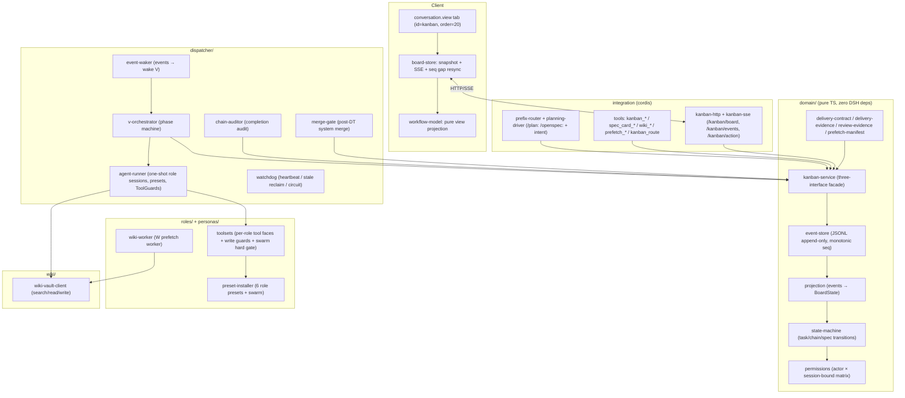

# dsh-swarm

[简体中文](README.zh-CN.md) · [English](README.md)

---

**说一句需求，回复一声确认——六名专职 agent 从规划到交付全程接管，一个命令都不用记。**

dsh-swarm 是 DSH 的一个插件：把一个需求变成一条严格、证据可核验的交付流水线。
编排者（V）把已批准的规格拆成严格有序的相位链（`p → (pt?) → w2 → d → dt → w3 → summary`）；
六个单一职责的角色（V / P / W / D / PT / DT）以隔离、受权限约束的工具面各执行一个相位；
每份交接都经机器校验；故障通过幂等重试与人工把关的评审恢复；实时 Workflow 看板标签页通过
SSE 把全部状态流式同步到浏览器。设计灵感源自 [Hermes Agent kanban](https://github.com/NousResearch/hermes-agent)。


---

## 蜂群模式（推荐）

蜂群模式让主会话成为一个「领队」：**你说需求，它负责澄清、规划、确认、派工、跟进**。全程自然语言，不用记任何命令。

- **免记命令** —— 直接说需求即可，不需要 `/plan:`、`/openspec:` 前缀。
- **意图自动识别** —— 开发需求 → 进入澄清规划并建链；沉淀经验/复盘 → 记入记忆库；发通知到群 → 投递企微；问答/闲聊 → 直接回答。
- **确认闸防误建** —— 规划清单落库后，必须等你明确回复「确认 / 开干 / 开跑 / 开始 / go」等肯定语义才会建链；模糊、岔开话题、只提修改意见 = 未确认。
- **领队只读** —— 主会话不能写/改仓库源码，也不能执行 git 变更（push/commit/checkout 等）；写代码由流水线中的执行者（D）在隔离工作区完成，这是设计使然。
- **进度实查** —— 任何时刻问「进度怎么样」，领队都以看板实查结果播报，绝不虚构。

### 为什么这样设计

让多个 agent 一起干活，最常见的三种翻车：

- **角色漂移** —— 规划的人跑去写代码，执行的人给自己验收，最后没人对结果负责。
- **不可验证的交接** —— agent 说「做完了」却拿不出可复现的证据，下游在流沙上继续盖楼。
- **静默死锁** —— agent 停住不吭声，管线挂起；坏代码没经评审就被合入。

dsh-swarm 用一份「契约」对症下药：每个角色只有一项机器强制的职责；每次交接必须携带
结构化证据，缺了卡就过不去；每次停滞或评审失败都落入可见、可恢复的状态——而最终的
信任锚是你（人类）。技术底座是正确性优先的：确定性状态机、只追加事件日志、幂等调度器，
并有一套红队测试重放事件日志、拒绝任何非法流转（机制细节见[进阶](#进阶--开发者)）。

### 两种模式

| 模式 | 怎么用 | 说明 |
|---|---|---|
| **蜂群模式**（推荐） | 自然语言直接说需求 | 免记命令，意图自动识别，确认即跑 |
| **命令模式**（兼容） | `/plan: <需求>` → 澄清 → `/openspec: 确认执行` | 兼容保留，功能等价；未来可能移除，新用户请用蜂群模式 |

---

## 快速上手

### 1. 安装

前置：可用的 DSH 运行时（`@deepseek-ai/*`）、Node.js ≥ 22.19 与 npm。可选：wiki-vault HTTP 服务（知识库功能，见[配置](#配置)）。

```bash
npm install
npm run build        # tsc -p tsconfig.build.json + client bundle (lib/client.js)
dsh plugin --profile web add @joekytc/dsh-swarm
```

> 从 GitHub 源码安装：`dsh plugin --profile web add github:joekytc/dsh-swarm`

### 2. 切换主会话预设

把主会话的 agent preset 切换为 **蜂群模式（Swarm）**（插件安装后已就绪于 `$DSH_HOME/.agent-presets/swarm`）。

### 3. 说需求 → 确认 → 看进度

对话示例：

```
你：帮我在 admin 项目里加一个角色管理页面，支持增删改查和权限勾选

领队：先确认几个问题——
  · 角色字段需要哪些（名称/描述/状态/…）？
  · 权限来源是现有菜单树还是自定义？
  · 验收有什么要求，比如「删除角色后关联用户不受影响」？

你：字段就名称和描述，权限用现有菜单树，验收按 TDD 来

领队：规划清单已落库（规格六段 + 仓库事实）。回复「确认」即可启动，
      我会拉起 p → (pt) → w2 → d → dt → w3 流水线。

你：确认

领队：链已创建（ch_…），实时进度见看板标签页（对话 → 轨迹 → 看板）。
      首个相位：规划（P）…
```

- **看板**：会话中心第三个标签页（对话 → 轨迹 → 看板），点卡片查看 概览 / 轨迹 / 交接 / 规格 / 评论。
- **完成**：链路完成时系统审计工作区，并（对 D 链）把特性分支自动合并到规格声明的目标分支；若触发审计警告，需先在 GUI 确认归属。
- **查进度**：直接问「进度怎么样」，领队实查看板播报；阻塞会如实转述原因。

---

## 它替你做了什么

六个角色，各管一件事，机器强制边界、绝不越权：

| 角色 | 一句话职责 | 绝不做什么 |
|---|---|---|
| **V** 编排者 | 逐相位建卡、驱动流水线、停滞时给指引 | 不执行任务 |
| **P** 规划者 | 读规格 + 仓库事实，写实施计划 | 不写代码 |
| **PT** 计划评审 | 只读评审 P 的计划（按需出现） | 不改任何东西 |
| **W** 知识官 | 规划/完成阶段同步知识库 | 不碰代码/git |
| **D** 执行者 | 唯一写代码的角色：实现 → 验证 → 提交 → 推特性分支 | 不直接合入目标分支 |
| **DT** 实现评审 | 实证验证 D 的交付（测试/构建/类型/diff） | 对仓库只读 |

流水线（链路内严格串行，链路间并行）：

```text
p ──> (pt?) ──> w2 ──> d ──> dt ──> w3 ──> summary
计划    计划评审   计划同步  实现   实现评审  知识库同步  收尾
```

- `pt` 仅当 P 判定需要计划评审时出现；`d` 之后**总是**创建实现评审（`dt`）。
- 链路完成由机械规则判定（W3 完成 + D 带交付证据完成 + 无未完成任务），不是 agent 自评。

---

## 配置

所有键均可选；schema 见 `src/config.ts`。**多数使用者只需关心前三项**，其余保持默认即可。

| 键 | 默认值 | 说明 |
|---|---|---|
| `storageDir` | `$DSH_HOME/storages/kanban` | 事件日志（`events.jsonl`）、编排状态、每任务工作区、`dispatcher.log`。取值须用不加引号的 `!!js dshHomePath("storages/kanban")` 写法，加引号会退化成字面量字符串 |
| `wikiVault.baseUrl` | `''`（空） | 知识库读写用的 wiki-vault HTTP 服务——知识库功能必需，填你自己的服务地址 |
| `roles.models.<role>` | `{}` | 每角色模型：`{ provider, model, reasoningEffort?, fallbacks?[] }` |
| `roles.models.<role>.reasoningEffort` | `high` | 所有角色默认推理强度 |
| `roles.models.<role>.fallbacks` | `[]` | 静默回退候选（经 `[model-fallback]` 评论审计） |
| `dispatcher.staleTimeoutSeconds` | `14400` | 心跳超时；无心跳的 running 任务被回收 |
| `dispatcher.maxRetries` | `3` | 失败重试上限，超出进入熔断 → `blocked(gave_up)` |
| `dispatcher.heartbeatIntervalSeconds` | `300` | 看门狗心跳周期 |
| `dispatcher.maxProtocolViolations` | `2` | 协议违规护栏：连续违规超过该次数后，下一次即终局（`gave_up`） |
| `dispatcher.maxReworksPerRole` | `{ pt: 2, dt: 3 }` | 评审返工轮数上限，超出进入 `review/gave-up` + `[review-final]` |
| `prefixRoutes.plan` | `/plan:` | 命令模式阶段 0 规划前缀 |
| `prefixRoutes.openspec` | `/openspec:` | 命令模式批准并执行前缀 |
| `ui.enabled` | `true` | 启用看板 Web 标签页 |
| `ui.contentMinWidth` | `715` | 看板内容最小宽度（px） |
| `ui.contentMaxWidth` | `780` | 看板内容最大宽度（px） |
| `ui.sseHeartbeatSeconds` | `20` | SSE 心跳间隔 |

---

## 信任与护栏（使用者视角）

- **领队只读硬闸** —— 蜂群模式主会话写/改源码与 git 变更被系统硬闸拦截；被拦时向领队说明即可，执行由 D 角色完成。
- **确认闸** —— 未经你明确确认，不会建链。
- **TDD 硬闸** —— 实现必须带测试（或说明跳过原因）；评审会机器核验「测试真的跑过、且先写」。
- **人工信任锚** —— 规格审批、解除阻塞、审计确认、整链删除仅人类可做；主会话与角色 agent 都不能建链或批准规格。
- 详细机制（权限矩阵、交付契约、评审链、返工、故障恢复）见[进阶 / 开发者](#进阶--开发者)。

---

## 进阶 / 开发者

> 以下为机制与实现细节，普通使用者可跳过。

### 角色与执行管线（详表）

六个角色由调度器作为一次性 agent 会话派发（确定性会话 id `kbn-<taskId>`，重试/返工时经 `resumeSessionId` 恢复）。每个角色 agent 会话绑定到恰好一个任务（`boundTaskId`），并获得裁剪后的工具面。V 是例外：链级编排会话（`kbn-v-<chainId>`），无 `boundTaskId`。

| 角色 | 别名 | 职责 | 工具面（要点） |
|---|---|---|---|
| **V** | 编排者 | 驱动相位机，逐相位建卡，停滞时发布 `[blocked-review]` 指引。绝不执行。 | `kanban_create` + 任务工具 + 规格查看 |
| **P** | 规划者 | 读取规格 + 仓库事实（含只读自查），编写 OpenSpec 实施计划，用 `pt_decision.needed` 决定是否需要 PT。绝不执行。 | 任务工具 + 规格查看，只读（仅写 `openspec/changes/`） |
| **PT** | 计划评审者 | 对 P 的计划做只读评审（需求对齐、完整性、逻辑）。输出裁决 + 问题清单。 | 任务工具 + 规格查看，**只读 ToolGuard** |
| **W** | 知识官 | W2/W3 知识库同步（`w:kb`）。绝不碰代码/git。 | 任务工具 + 远程 `wiki_search/read/write` / 本地 `skill`→llm-wiki + 只读规格查看 |
| **D** | 执行者 | *唯一*写代码的角色：worktree → 实现 → 验证 → `[AI-GEN]` 提交 → 推送特性分支（合入规格声明的目标分支由 system 在 DT 通过后执行）。 | 任务工具 + wiki 只读 + bash/fs/run_code（完整开发面）+ subagent（spawn/fork/list-agents）+ goal |
| **DT** | 实现评审者 | 实证验证 D 的工作（test/build/typecheck/diff/git + open-code-review），把评审页写入知识库。对仓库只读。 | 任务工具 + wiki 读写（评审命名空间）+ bash/fs/run_code，**只读 ToolGuard** |

### 护栏详解

#### 权限矩阵

`can(action, actor, task, { boundTaskId })` 定义于 `src/domain/permissions.ts`。
"Bound" 表示该 actor 是*针对那个精确任务*派生的角色 agent 会话（`boundTaskId === task.id`，
且 `complete` 还要求 `actor === task.assignee`）。

| 动作 | V | P | W | D | PT | DT | 人类 | 系统 |
|---|---|---|---|---|---|---|---|---|
| create-chain / create-task | ✅ | ❌ | ❌ | ❌ | ❌ | ❌ | ✅ | ❌ |
| claim | ❌ | ❌ | ❌ | ❌ | ❌ | ❌ | ❌ | ✅ |
| complete | ❌ | bound | bound | bound | bound | bound | ✅（GUI） | ✅ |
| block | ❌ | bound | bound | bound | bound | bound | ✅ | ✅ |
| heartbeat | ❌ | bound | bound | bound | bound | bound | ❌ | ❌ |
| comment | ✅ | ✅ | ✅ | ✅ | ✅ | ✅ | ✅ | ✅ |
| unblock | ❌ | ❌ | ❌ | ❌ | ❌ | ❌ | ✅ | ❌ |
| archive | ✅ | ❌ | ❌ | ❌ | ❌ | ❌ | ✅ | ❌ |
| spec-approve | ❌ | ❌ | ❌ | ❌ | ❌ | ❌ | ✅ | ❌ |
| spec-edit | ❌ | ❌ | ❌ | ❌ | ❌ | ❌ | ✅ | ❌ |
| spec-attach | ✅ | ❌ | ❌ | ❌ | ❌ | ❌ | ✅ | ❌ |
| update-title | ❌ | ❌ | ❌ | ❌ | ❌ | ❌ | ✅ | ❌ |
| delete-chain | ❌ | ❌ | ❌ | ❌ | ❌ | ❌ | ✅ | ❌ |
| wiki-write | ❌ | ❌ | ✅ | ❌ | ❌ | ✅（评审命名空间） | ❌ | ❌ |
| wiki-read | ❌ | ❌ | ✅ | ✅ | ❌ | ✅ | ❌ | ❌ |
| prefetch | ❌ | ❌ | ✅ | ❌ | ❌ | ❌ | ❌ | ❌ |
| audit-confirm | ❌ | ❌ | ❌ | ❌ | ❌ | ❌ | ✅ | ❌ |
| create-rework-task | ❌ | ❌ | ❌ | ❌ | ❌ | ❌ | ❌ | ✅ |

关键保证（两点）：

- **主会话不能执行。** 它只拿到 `kanban_show`/`kanban_list`/`kanban_comment` +
  `spec_card_view` + `kanban_route` —— 绝无 `kanban_create`/`kanban_complete`/
  `kanban_block`。建链/建规格只经蜂群模式意图或 `/plan:`+`/openspec:`；GUI 只观察与变更任务状态，
  从不建链/建任务——"谁决定运行什么"保持显式、可审计。
- **会话绑定阻止跨任务越权**（绑定到任务 A 的 W agent，即使任务 B 同为 W 任务，也
  不能 complete/block 任务 B）；DT 的写入被矩阵之上的 ToolGuard 限定在
  `projects/<repoSlug>/<chain>/review/` 命名空间；且任何角色 agent 都不能批准规格、解除阻塞或
  确认审计——这些是人类信任锚；`system` 只做机械性记账。

#### 交付契约（上游欠下游）

每个相位的交接必须携带下游真正会读到的键（`src/domain/delivery-contract.ts`）。
缺键会立即阻塞当前角色的卡（且编排者不会在阻塞的父任务上建下游卡）：

| 卡 | 必需交接键 |
|---|---|
| W2 / W3（`w:kb`） | `kb_url` + `page_path` |
| P（`p:openspec`） | `artifacts_path` + `pt_decision`（`needed` 布尔必填；`needed: true` 时 `reason` 必填） |
| D（`d:execute`） | `changed_files` +（`commit_hash` 或 `push`）——`hasDeliveryEvidence`；`branch`（特性分支）是合并闸门的期望输入，非硬性完成阻塞项；`tdd`（`test_files` 或 `skipped.reason`，二选一） |
| PT / DT | `review_evidence`（schema 合法）——`validateReviewEvidence` |

#### TDD 硬闸（证据门槛）

D 只有带 `tdd` 才能完成——`test_files`（含 `test_first`）或 `skipped.reason`
（二选一，见 `delivery-evidence.ts`）。DT 的 `review_evidence` 必须携带 `tdd`；
`pass` 裁决下 runner 必须是 `vitest`（`test.runner`）且 `test_first === true`
（见 `review-evidence.ts`）。这让"测试确实跑过、且先写测试"成为机器校验的属性，
而非一句声明。

#### 阶段 0 规划清单

规划期跑只读规划会话（`grill-me` → `planning_prefetch` → `planning_checklist_save`，
见 `planning-driver.ts`）。清单携带结构化 manifest（仓库事实 + 文件基线，见
`prefetch-manifest.ts`）；非法 manifest 阻塞保存，建链时把清单以 `file-prefetch`
+ `kb` 附件挂到规格卡（见 `prefix-router.ts`）。

#### 评审质量链

- **P** 完成后，仅当 P 的交接交付 `pt_decision.needed = true` 时才创建 **PT** 卡；
  编排者从不覆盖该判定（V 只负责建卡）。
- **D** 完成后**总是**创建 **DT** 卡。
- **PT/DT 只读**：ToolGuard 机械性拒绝写仓库源码、git 变更，以及（对 DT）评审命名空间
  之外的 wiki 写入。
- **DT 评审引擎**：`open-code-review`（ocr，委派模式，diff `--from <目标分支> --to <特性分支>`）
  → 回退 `superpowers code-review` → 两者都不可用才 block `review-tool-unavailable`。
- `review_evidence` 必须通过 `validateReviewEvidence`，否则评审卡无法完成：PT 需要
  verdict + issues + 计划引用；DT 额外需要 test（通过时退出码 0）、build/typecheck、
  lint、非空 diff、git、ocr/回退结论，以及 `tdd`。

#### 返工（评审失败）

评审失败**从不改写** `done` 卡。系统改为记录 `review/failed`，创建**返工任务**
（`[返工] ...`），继承源会话（`resumeSessionId`）、`reviewAttempt + 1`，初始为
`todo`（`reviewStatus: 'pending'`），然后为返工重新派发全新评审卡。当 `reviewAttempt`
达到 `maxReworksPerRole`（PT 2 / DT 3）时，系统记录 `review/gave-up` 并发布
`[review-final]` 证据链评论；管线停在评审阶段等待人类介入。

#### 故障恢复

两条正交的故障路径，都可人工恢复：

- **协议违规**（agent 空闲却未 `complete`/`block`）：角色 agent →
  `blocked(protocol_violation)` → V 发布幂等 `[blocked-review]` 指引 → 人类解除阻塞 →
  同会话恢复（NOT 重新开始）。超过 `maxProtocolViolations`（2）次可恢复循环后，
  下一次违规 → `blocked(gave_up)` + system 发布 `[blocked-final]` 证据链（阻塞时间线 +
  评审/评论时间线 + 最终原因）。
- **硬故障与熔断**：`task/failed` 累加 `attempts`；调度器在 `attempts < maxRetries` 时
  重新派发（同会话恢复），随后熔断到 `blocked(gave_up: max retries)`。看门狗回收在
  `staleTimeoutSeconds` 内停止心跳的 `running` 任务（心跳本身只是*状态*信号，绝不是
  业务变更；SSE 心跳从不携带看板状态）。每角色模型候选（主模型 + 回退，默认
  `reasoningEffort: high`）静默回退（经 `[model-fallback]` 评论审计）；*所有*候选都失败
  则 block `model-unavailable` 等待人类。单个挂起的 V 唤醒不会卡死调度器——每次派发
  都被包在超时里。

#### 链路完成：审计闸门 + 合并闸门

机械性链路完成规则触发时，两个闸门在 `chain/completed` 钩子中运行：

1. **完成审计闸门**：`ChainAuditor` 交叉核对链路工作区中是否存在已知任务输出
   之外的产物。发现孤儿写入即发出 `chain/audit-warning`；UI 显示警告横幅并阻塞最终
   汇报，直到人类确认归属（`chain/audit-confirmed`，仅限人类）。
2. **合并闸门（DT 通过后的系统合并）**：D 从不合并到目标分支，也不推送它——D 只提交到
   （可选推送）自己的特性分支，并在交接中携带 `branch`。目标分支是规格中声明的分支
   （V 写入 D 任务体）。DT 批准且链路完成后，`merge-gate.ts` 以 `system` 身份执行：
   `git checkout <目标分支> → git merge --no-ff <特性分支> → git push`。结果以幂等评论记录：
   `[merge-done]`（带 hash）、`[merge-skip]`（合并输入无法解析）、`[merge-failed]`
   （checkout/merge/push 失败，例如冲突）。失败绝不抛错——坏合并*不执行*，这是安全方向；
   人类事后可修复。

### 事件溯源与领域模型

每次状态变更都追加到 `<storageDir>/events.jsonl`，每行一个 JSON 事件。`seq` 由存储
分配（每次追加时从文件尾部重读，并发实例永不冲突）。**轨迹即事件日志本身**；重启回放
日志即可重建看板。

```jsonc
// events.jsonl 中的一行
{ "seq": 12, "chainId": "ch_x_...", "taskId": "t_y_...",
  "kind": "task/completed",
  "payload": { "summary": "...", "metadata": { /* 交接证据 */ } },
  "author": "w", "at": 1760000000000 }
```

事件族：`chain/*`（created, executing, completed, aborted, root-task-set,
audit-warning, audit-confirmed, title-updated）、`spec-card/*`（created, edited,
approved）、`task/*`（created, claimed, heartbeat, commented, completed, blocked,
unblocked, failed, archived, renamed）、`review/*`（passed, failed, gave-up）。

回放是**严格**的：投影把每个事件经过状态机应用，任何非法转换都会抛错——损坏或被篡改的
日志会响亮失败，而不是静默产出不一致的看板（由 `tests/redteam/anti-escalation.test.ts`
与 `tests/domain/projection.test.ts` 覆盖）。

服务通过串行队列发布事件（先落盘再发布），订阅方（SSE）按序收到每个事件且恰好一次。
UI 与调度器消费的是同一份持久化事件——不存在第二个真相源。

### Web 客户端（Workflow 看板标签页）

注册为第三个 `conversation.view` 槽位的浏览器半 React 标签页（`id=kanban`、`order=20`，
位于 对话 与 轨迹 之后）。它**不**注册 shell 级浮层、侧栏或详情抽屉。

- **数据路径**：初始快照（`GET /kanban/board`）→ SSE 流（`GET /kanban/events?after=<seq>`）
  → board-store 增量应用事件、按 `seq` 去重，任何缺口都重拉完整快照。**无业务轮询。**
- **布局**：多链路垂直轨道；内容宽度固定 715–780 px，整高；当前链路展开，阻塞链路
  始终显示警告摘要。页内改名/删除用轻量弹窗（无 shell 浮层）；无拖拽、无宽度记忆。
- **卡片**：紧凑双行卡片 + 按 profile 着色的节点；状态线为 绿实线（完成）/ 蓝实线（当前）/
  灰虚线（等待）/ 红断点（阻塞）。
- **详情抽屉**：五区——概览 / 轨迹 / 交接 / 规格 / 评论；`Esc` 或返回回到列表。
- **动作**（`POST /kanban/action`）：block / unblock / retry / complete / archive /
  comment，外加链路级 `confirm-audit`、`rename`（链或任务）与 `delete`（整链，仅 human，
  GUI 二次确认）。人类动作应用带回滚的乐观更新；store 在任何分歧时对权威快照重新对账。
- **构建**：`npm run build:client` 生成 `lib/client.js`，采用 `window.__ModuleLoader__.load()`
  格式（与 `dsh-client-*` 相同的约定）。把 dsh-swarm 加入 web profile 会自动把它嵌入
  `__DSH_BOOT__`。

### 架构

五层结构，领域层**不依赖任何 DSH**，因此可以被完全单测并独立回放。



#### 各层职责

- **领域层**（`src/domain/`）—— 整个业务模型，纯 TypeScript：事件存储、状态机、投影、
  权限矩阵、交付/评审/manifest 校验器，以及把来自工具、CLI、UI 的每次写入统一路由到
  单一权威的 `KanbanService` 门面。单测充分覆盖。
- **集成层**（`src/tools/`、`src/routes/`）—— cordis 工具与路由：角色工具面、主会话
  工具（`kanban_route` + 只读子集）、`/kanban/*` HTTP/SSE 桥。
- **调度层**（`src/dispatcher/`）—— 事件唤醒、相位编排、一次性 agent 运行器（persona
  preset 挂载、模型候选链、ToolGuard 安装）、看门狗、链路审计器、合并闸门。
- **角色层**（`src/roles/`、`personas/`）—— 安装到 `$DSH_HOME/.agent-presets/` 的裁剪
  preset（含蜂群模式 `swarm`）、每角色工具装配、写保护逻辑与蜂群会话硬闸。
- **知识库层**（`src/wiki/`）—— 面向 wiki-vault 的轻量 HTTP 客户端。

### 开发

质量闸门（见 `AGENTS.md`）：

```bash
npm run typecheck   # tsc -p tsconfig.json --noEmit  (0 errors)
npm test            # npx vitest run  （全绿）
npm run build       # tsc -p tsconfig.build.json + build:client (lib/client.js)
```

GUI 验证（仅当端口 3080 上已有 dsh web 实例时；**不要**启动第二个实例）：

```bash
python tests/e2e/gui-check.py --url http://127.0.0.1:3080/
```

> 部署到运行中的 DSH 实例需要插件重载/重启；仅构建不会热重载正在运行的插件。

### 已实现与已知限制

#### 已实现（v0.1.0）

- [x] **蜂群模式**：自然语言意图识别（plan/openspec/learning/send）+ 确认闸 + 主会话只读硬闸
- [x] 事件溯源领域 + 确定性状态机（红队回放）
- [x] 6 角色相位管线 + 裁剪 preset + 会话绑定权限
- [x] 交付契约 + 评审证据闸门 + 返工生命周期
- [x] TDD 硬闸（D `tdd` 交接 + DT `test_first` / `runner=vitest` 核验）
- [x] 协议违规恢复、心跳看门狗、失败熔断
- [x] 链路完成审计闸门 + 人工确认
- [x] DT 通过后合并闸门（D 只推送特性分支）
- [x] 阶段 0 规划清单 + `file-prefetch` 附件
- [x] GUI 链/任务改名 + 整链删除（仅 human）
- [x] 模型候选链：静默回退 + High 推理强度
- [x] 实时 SSE 看板标签页（对话 → 轨迹 → 看板）

#### 已知限制

- **蜂群模式意图识别依赖模型自判**：误判有确认闸兜底（未确认不建链），非零误判风险。
- **写保护是字符串启发式，不是硬隔离。** PT/DT ToolGuard 依赖路径/命令正则，评审者
  没有 git 凭据；这是软约束加审计轨迹，而非挂载级沙箱。
- **验证环境中没有 `open-code-review` CLI**：回退路径（superpowers `code-review`）
  已实现并测试，但 ocr 委派模式输出解析有待在装有 ocr 的机器上验证。
- **评审证据是存在性检查，而非回放证明。** 字段必须存在且格式合法；证明测试确实运行尚未实现。
- **配置默认值里只有一个 wiki-vault 主机**——请把 `wikiVault.baseUrl` 指向你的部署。
- **PT 建卡依赖 P 自报的 `pt_decision.needed`**——从仓库信号做系统辅助检测尚未实现。

---

## 许可证

[MIT](LICENSE)
