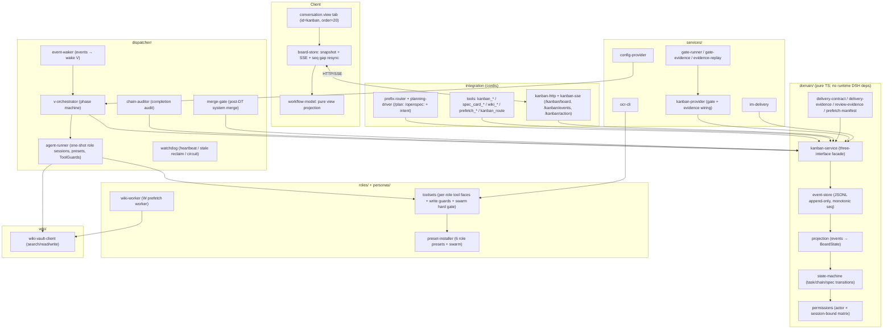

# dsh-swarm

[简体中文](README.zh-CN.md) · [English](README.md)

---

**说一句需求，回复一声确认——六名专职 agent 从规划到交付全程接管，一个命令都不用记。**

dsh-swarm 是 DSH 的一个插件：把一个需求变成一条严格、证据可核验的交付流水线。
编排者（V）把已批准的规格拆成严格有序的相位链（`p → (pt?) → w2 → d → dt → w3 → summary`）；
六个单一职责的角色（V / P / W / D / PT / DT）以隔离、受权限约束的工具面各执行一个相位；
每份交接都依据证据契约经机器校验；故障通过幂等重试与人工把关的评审恢复；实时 Workflow 看板标签页通过
SSE 把全部状态流式同步到浏览器。设计灵感源自 [Hermes Agent kanban](https://github.com/NousResearch/hermes-agent)。


---

## 蜂群模式（推荐）

蜂群模式让主会话成为一个「领队」：**你说需求，它负责澄清、规划、确认、派工、跟进**。全程自然语言，不用记任何命令。

- **免记命令** —— 直接说需求即可，不需要 `/plan:`、`/openspec:` 前缀。
- **意图自动识别** —— 开发需求 → 进入澄清规划并建链；沉淀经验/复盘 → 记入记忆库；发通知到群 → 投递企微；问答/闲聊 → 直接回答。意图由模型自判，非代码级分类器；误判由下方确认闸拦住。
- **自由投递** —— `/sms <意图>`（如「把当前进度发到群」）：先实查看板取事实基准，再按意图生成正文投递；`-s` 或自然语言「私聊」→ 发送私聊。`/sms` 空参＝重发最近完成链的完成汇报，`/sms blocked [chainId]`＝阻塞通知，这两类正文由系统按看板事实渲染，领队不复述、不改写。群聊/私聊目标自动解析为唯一已保存目标（0 个或多个报错；到 dsh-im 设置清理，或显式指定 `imDelivery.targetId` / `imDelivery.dmTargetId`——显式指定不再校验数量，但 `imDelivery.botId` 留空时该目标仍须归属自动发现的机器人，否则报错）。
- **确认闸防误建** —— 规划清单落库后，领队被要求仅在你明确回复「确认 / 开干 / 开跑 / 开始 / go」等肯定语义后才建链；判定由模型完成，非代码级校验。模糊、岔开话题、只提修改意见 = 未确认。
- **领队只读** —— 主会话不能写/改仓库源码，也不能执行 git 变更（push/commit/reset 等）；裸 `git checkout`/`git switch` 已存在分支放行。写代码由流水线中的执行者（D）在隔离工作区完成，这是设计使然。
- **进度实查** —— 任何时刻问「进度怎么样」，领队都以看板实查结果播报，绝不虚构。

### 为什么这样设计

让多个 agent 一起干活，最常见的三种翻车：

- **角色漂移** —— 规划的人跑去写代码，执行的人给自己验收，最后没人对结果负责。
- **不可验证的交接** —— agent 说「做完了」却拿不出可复现的证据，下游在流沙上继续盖楼。
- **静默死锁** —— agent 停住不吭声，管线挂起；坏代码没经评审就被合入。

dsh-swarm 用一份「契约」对症下药：每个角色只有一项职责，由权限矩阵、工具面与任务体指令共同约束；每次交接必须携带
结构化证据，缺了卡就过不去；每次停滞或评审失败都落入可见、可恢复的状态——而最终的
信任锚是你（人类）。技术底座是正确性优先的：确定性状态机、只追加事件日志、幂等调度器，
并有一套红队测试重放事件日志、拒绝任何非法流转（机制细节见[进阶](#进阶--开发者)）。

### 两种模式

| 模式 | 怎么用 | 说明 |
|---|---|---|
| **蜂群模式**（推荐） | 自然语言直接说需求 | 免记命令，意图自动识别，确认即跑 |
| **命令模式**（兼容） | `/plan: <需求>` → 澄清 → `/openspec: confirm` | 兼容保留，功能等价；未来可能移除，新用户请用蜂群模式 |

---

## 快速上手

### 1. 安装

前置：可用的 DSH 运行时（`@deepseek-ai/*`）、Node.js ≥ 22.19 与 npm。可选：wiki-vault HTTP 服务（知识库功能，见[配置](#配置)）。

从 npm 安装（发布包内已带构建产物 `lib/`）：

```bash
dsh plugin --profile web add @joekytc/dsh-swarm
```

从源码检出安装（先重建，保证 `lib/` 与源码一致）：

```bash
npm install
npm run build        # tsc -p tsconfig.build.json + client bundle (lib/client.js)
dsh plugin --profile web add .
```

> 从 GitHub 源码安装：`dsh plugin --profile web add github:joekytc/dsh-swarm`——仓库已跟踪构建产物 `lib/`。

### 2. 切换主会话预设

把主会话的 agent preset 切换为 **蜂群模式（Swarm）**（插件安装后已就绪于 `$DSH_HOME/.agent-presets/swarm`）。

### 3. 说需求 → 确认 → 看进度

对话示例：

```
你：帮我在 admin 项目里加一个角色管理页面，支持增删改查和权限勾选

领队：先确认几个问题——
  · 角色字段需要哪些（名称/描述/状态/…）？
  · 权限来源是现有菜单树还是自定义？
  · 验收有什么要求，比如「删除角色后关联用户不受影响」？

你：字段就名称和描述，权限用现有菜单树，验收按 TDD 来

领队：规划清单已落库（规格六段 + 仓库事实）。回复「确认」即可启动，
      我会拉起 p → (pt) → w2 → d → dt → w3 流水线。

你：确认

领队：链已创建（ch_…），实时进度见看板标签页（对话 → 轨迹 → 看板）。
      首个相位：规划（P）…
```

- **看板**：会话中心第三个标签页（对话 → 轨迹 → 看板），点卡片查看 概览 / 轨迹 / 交接 / 规格 / 评论。
- **完成**：链路完成时系统审计工作区，并（对 D 链）把特性分支自动合并到规格声明的目标分支；触发审计警告会阻塞最终汇报、直到你在 GUI 确认归属（不阻塞合入）。
- **查进度**：直接问「进度怎么样」，领队实查看板播报；阻塞会如实转述原因。

---

## 它替你做了什么

六个角色，各管一件事——边界由权限矩阵、裁剪后的工具面与任务体指令共同约束，绝不越权：

| 角色 | 一句话职责 | 绝不做什么 |
|---|---|---|
| **V** 编排者 | 逐相位建卡、驱动流水线、停滞时给指引 | 绝不执行 |
| **P** 规划者 | 读规格 + 仓库事实，写实施计划 | 不写代码 |
| **PT** 计划评审 | 只读评审 P 的计划（按需出现） | 不改任何东西 |
| **W** 知识官 | 规划/完成阶段同步知识库 | 不碰代码/git |
| **D** 执行者 | 唯一写代码的角色：实现 → 验证 → 提交 → 推特性分支 | 绝不自行合入目标分支 |
| **DT** 实现评审 | 实证验证 D 的交付（测试/构建/类型/diff） | 对仓库只读 |

流水线（链路内严格串行，链路间并行）：

```text
p ──> (pt?) ──> w2 ──> d ──> dt ──> w3 ──> summary
计划    计划评审   计划同步  实现   实现评审  知识库同步  收尾
```

- `pt` 仅当 P 判定需要计划评审时出现；`d` 之后**总是**创建实现评审（`dt`）。
- 链路完成由机械规则判定（W3 完成 + D 带交付证据完成 + 无未完成任务），不是 agent 自评。

---

## 配置

所有键均可选；schema 见 `src/config.ts`。**多数使用者只需关心前三项**，其余保持默认即可。

| 键 | 默认值 | 说明 |
|---|---|---|
| `storageDir` | `$DSH_HOME/storages/kanban` | 事件日志（`events.jsonl`）、编排状态、每任务工作区、`dispatcher.log`。取值须用不加引号的 `!!js dshHomePath("storages/kanban")` 写法，加引号会退化成字面量字符串 |
| `wikiVault.baseUrl` | `''`（空） | 知识库读写用的 wiki-vault HTTP 服务——知识库功能必需，填你自己的服务地址 |
| `wikiVault.pagePrefix` | `projects/` | 生成知识库页面的命名空间前缀 |
| `roles.models.<role>` | `{}` | 每角色模型：`{ provider, model, reasoningEffort?, fallbacks?[] }` |
| `roles.models.<role>.reasoningEffort` | `high` | 所有角色默认推理强度 |
| `roles.models.<role>.fallbacks` | `[]` | 静默回退候选（经 `[model-fallback]` 评论审计） |
| `dispatcher.staleTimeoutSeconds` | `14400` | 心跳超时；无心跳的 running 任务被回收 |
| `dispatcher.maxRetries` | `3` | 失败重试上限，超出进入熔断 → `blocked(gave_up)` |
| `dispatcher.heartbeatIntervalSeconds` | `300` | 看门狗心跳周期 |
| `dispatcher.maxProtocolViolations` | `2` | 协议违规护栏：连续违规达到该次数后，下一次即终局（`gave_up`） |
| `dispatcher.maxReworksPerRole` | `{ pt: 3, dt: 3 }` | 评审返工轮数上限，超出进入 `review/gave-up` + `[review-final]` |
| `prefixRoutes.plan` | `/plan:` | 命令模式阶段 0 规划前缀 |
| `prefixRoutes.openspec` | `/openspec:` | 命令模式批准并执行前缀 |
| `prefixRoutes.learning` | `/learning` | 经验 / 复盘沉淀前缀 |
| `prefixRoutes.send` | `/sms` | 自由投递前缀（`-s` 发私聊） |
| `memory.enabled` | `true` | 记忆召回索引；`false` 时 `planning_memory_recall` 返回 disabled 提示 |
| `memory.maxIndexEntries` | `8` | 记忆召回条数上限（1–20） |
| `ui.enabled` | `true` | 声明的开关；尚未被消费——标签页恒定注册 |
| `ui.contentMinWidth` | `715` | 声明的宽度下界（px）；客户端尚未消费——标签页宽度沿用宿主会话宽度 |
| `ui.contentMaxWidth` | `780` | 声明的宽度上界（px）；客户端尚未消费 |
| `ui.sseHeartbeatSeconds` | `20` | SSE 心跳间隔 |
| `gates.enabled` | `true` | TDD 实测闸开关；`false` → 静默跳过（不发事件） |
| `gates.timeoutMs` | `600000` | 单条闸命令超时（ms），到点 SIGKILL |
| `gates.forbidden` | `['rm -rf /', 'git push']` | 命令黑名单子串（纵深防御） |
| `evidenceReplay.enabled` | `false` | L3 重放模型写的命令——非沙箱，见[评审问题取证](#评审问题取证pr2默认关) |
| `evidenceReplay.timeoutMs` | `600000` | 单条重放命令超时（ms） |
| `evidenceReplay.allowPrefixes` | `['npx --no-install vitest', 'npm test', 'npm run build', 'npm run typecheck', 'tsc', 'eslint']` | 已知工具前缀白名单（词边界匹配） |
| `imDelivery.enabled` | `false` | 经 dsh-im 投递企微（W3 收尾 / 链阻塞 / 评审超限） |
| `imDelivery.botId` | `''` | 留空 = 自动发现唯一 wecom bot |
| `imDelivery.targetId` | `''` | 留空 = 自动发现唯一已保存群目标 |
| `imDelivery.dmTargetId` | `''` | `/sms -s` 私聊目标 |
| `imDelivery.fallbackBotId` | `''` | 预设匹配未命中时的落点机器人 |
| `reviewEngine.mode` | `delegate` | `delegate` 或 `managed`——见[评审引擎（ocr）](#评审引擎ocr) |
| `reviewEngine.managed.provider` | `''` | 托管模式使用的模型链 provider id |
| `reviewEngine.managed.model` | `''` | 托管模式使用的模型链 model id |
| `wikiWritePresets` | `['swarm', 'kanban-w', 'ptc']` | 放行 `wiki_write` 的 preset 白名单（页面路径仍受命名空间白名单约束） |

---

## 评审引擎（ocr）

实现评审（链上 DT 相位与独立评审）由 [open-code-review](https://open-codereview.ai)（ocr）驱动，
支持两种模式，在 Web 配置面板「Swarm 配置 → 评审引擎（ocr）」卡切换：

| 模式 | 工作方式 | 特点 |
|---|---|---|
| **委托**（默认） | ocr 只输出评审范围与规则，由 DT 自己的模型逐文件深入评审 | 零 API key，开箱即用 |
| **托管** | ocr 调用你选定的提供方/模型跑完整评审，一次返回归一化 findings | 适合大变更集；委托模式下超 50 文件时会提示可切换（仅提醒，不自动切换） |

### 安装

- 未安装时配置面板出现红横幅，点「安装 ocr」一键全局安装（异步执行，可取消）；
- 或在终端执行 `npm install -g @alibaba-group/open-code-review`，装后用 `ocr --version` 验证。

### 独立评审（不建链也能评）

1. 在 dsh Web 顶部把会话切换为「交付评审官（DT）」，直接对话；
2. 说清评审对象：本地目录 / 分支 range（from…to）/ 单个 commit / 工作区未提交 diff / 公开仓库 URL（自动 clone 到临时目录，评完即弃）；
3. 报告先完整输出到对话；
4. 你确认后再写入知识库 `projects/<仓库>/reviews/<主题>-<日期>/`——仅远程知识库模式；`wikiVault.baseUrl` 留空（本地模式）时报告不落 wiki 页。

只读口径：bash/run_code 写入与 reviews 命名空间之外的 wiki 写入被护栏拦截；独立 DT 会话的 fs `write`/`edit` 未被拦截。

### 配置要点

- 模式、提供方与模型都在「评审引擎（ocr）」卡选择，提供方/模型下拉与「模型链」同一目录；
- 选好后点「应用到 ocr」，系统自动把接入点写入 ocr 自定义配置（`dsh-managed`）；API key 由 dsh 模型配置解析后写入 ocr，面板不展示明文；解析失败会降级并指引你在终端手动执行 `ocr config provider`；
- 托管未就绪时 ocr 工具拒绝托管调用并返回委托指引，由评审者改走委托模式，不阻断。

官方文档：[安装指南](https://open-codereview.ai/docs/installation) · [模型配置](https://open-codereview.ai/docs/configuration) · [委托模式](https://open-codereview.ai/docs/delegate)

---

## 信任与护栏（使用者视角）

- **领队只读硬闸** —— 蜂群模式主会话写/改源码与 git 变更被系统硬闸拦截；被拦时向领队说明即可，执行由 D 角色完成。
- **确认闸** —— 领队只在收到你明确肯定回复后才建链（由领队指令约束，非代码级校验）。
- **TDD 硬闸** —— 实现必须带测试（或说明跳过原因）；评审会机器核验「测试真的跑过、且先写」。
- **人工信任锚** —— 规格审批、解除阻塞、审计确认、整链删除仅人类可做；角色 agent 不能批准规格，链只在你的确认路由调用下创建（主会话以 `human` 身份路由）。
- **护栏是约束，不是沙箱** —— PT/DT 写保护依赖路径/命令正则（评审者没有 git 凭据），且评审证据是存在性检查：字段必须存在且格式合法；真去重放命令证明「确实跑过」只在打开 `evidenceReplay.enabled` 时才发生。
- 详细机制（权限矩阵、交付契约、评审链、返工、故障恢复）见[进阶 / 开发者](#进阶--开发者)。

---

## 进阶 / 开发者

> 以下为机制与实现细节，普通使用者可跳过。

### 角色与执行管线（详表）

六个角色由调度器作为一次性 agent 会话派发（确定性会话 id `kbn-<taskId>`；重试在同一会话上恢复——`resumeSessionId` 在当前实现中恒为 null；返工则另起 `kbn-<reworkId>` 新会话）。每个角色 agent 会话绑定到恰好一个任务（`boundTaskId`），并获得裁剪后的工具面。V 是例外：链级编排会话（`kbn-v-<chainId>`），无 `boundTaskId`。

| 角色 | 别名 | 职责 | 工具面（要点） |
|---|---|---|---|
| **V** | 编排者 | 驱动相位机，逐相位建卡，停滞时发布 `[blocked-review]` 指引。绝不执行。 | `kanban_create` + 任务工具 + 规格查看 |
| **P** | 规划者 | 读取规格 + 仓库事实（含只读自查），编写 OpenSpec 实施计划，用 `pt_decision.needed` 决定是否需要 PT。绝不执行。 | 任务工具 + 规格查看，只读（仅写 `openspec/changes/`） |
| **PT** | 计划评审者 | 对 P 的计划做只读评审（需求对齐、完整性、逻辑）。输出裁决 + 问题清单。 | 任务工具 + 规格查看，**只读 ToolGuard** |
| **W** | 知识官 | W2/W3 知识库同步（`w:kb`）。绝不碰代码/git。 | 任务工具 + 远程 `wiki_search/read/write` / 本地 `skill`→llm-wiki + `prefetch_file`/`prefetch_external`/`prefetch_kb` + 只读规格查看 |
| **D** | 执行者 | *唯一*写代码的角色：worktree → 实现 → 验证 → `[AI-GEN]` 提交 → 推送特性分支（合入规格声明的目标分支由 system 在 DT 通过后执行）。 | 任务工具 + wiki 只读 + bash/fs/run_code（完整开发面）+ subagent（spawn/fork/list-agents）+ goal |
| **DT** | 实现评审者 | 实证验证 D 的工作（test/build/typecheck/diff/git + open-code-review），把评审页写入知识库。对仓库只读。 | 任务工具 + wiki 读写（评审命名空间）+ `ocr_review` + bash/fs/run_code，**只读 ToolGuard** |

### 护栏详解

#### 权限矩阵

`can(action, actor, task, { boundTaskId })` 定义于 `src/domain/permissions.ts`。
"Bound" 表示该 actor 是*针对那个精确任务*派生的角色 agent 会话（`boundTaskId === task.id`，
且 `complete` 还要求 `actor === task.assignee`）。

| 动作 | V | P | W | D | PT | DT | 人类 | 系统 |
|---|---|---|---|---|---|---|---|---|
| create-chain / create-task | ✅ | ❌ | ❌ | ❌ | ❌ | ❌ | ✅ | ❌ |
| claim | ❌ | ❌ | ❌ | ❌ | ❌ | ❌ | ❌ | ✅ |
| complete | ❌ | bound | bound | bound | bound | bound | ✅（GUI） | ✅ |
| block | ❌ | bound | bound | bound | bound | bound | ✅ | ✅ |
| heartbeat | ❌ | bound | bound | bound | bound | bound | ❌ | ❌ |
| comment | ✅ | ✅ | ✅ | ✅ | ✅ | ✅ | ✅ | ✅ |
| unblock | ❌ | ❌ | ❌ | ❌ | ❌ | ❌ | ✅ | ❌ |
| archive | ✅ | ❌ | ❌ | ❌ | ❌ | ❌ | ✅ | ❌ |
| spec-approve | ❌ | ❌ | ❌ | ❌ | ❌ | ❌ | ✅ | ❌ |
| spec-edit | ❌ | ❌ | ❌ | ❌ | ❌ | ❌ | ✅ | ❌ |
| spec-attach | ✅ | ❌ | ❌ | ❌ | ❌ | ❌ | ✅ | ❌ |
| update-title | ❌ | ❌ | ❌ | ❌ | ❌ | ❌ | ✅ | ❌ |
| delete-chain | ❌ | ❌ | ❌ | ❌ | ❌ | ❌ | ✅ | ❌ |
| wiki-write | ❌ | ❌ | ✅ | ❌ | ❌ | ✅（评审命名空间） | ❌ | ❌ |
| wiki-read | ❌ | ❌ | ✅ | ✅ | ❌ | ✅ | ❌ | ❌ |
| prefetch | ❌ | ❌ | ✅ | ❌ | ❌ | ❌ | ❌ | ❌ |
| audit-confirm | ❌ | ❌ | ❌ | ❌ | ❌ | ❌ | ✅ | ❌ |
| create-rework-task | ❌ | ❌ | ❌ | ❌ | ❌ | ❌ | ❌ | ✅ |
| reopen-chain | ❌ | ❌ | ❌ | ❌ | ❌ | ❌ | ✅ | ❌ |
| waive-review | ❌ | ❌ | ❌ | ❌ | ❌ | ❌ | ✅ | ❌ |

关键保证（两点）：

- **主会话不能执行。** 它的看板工具面是只读子集——`kanban_show`/`kanban_chain`/`kanban_list`/
  `kanban_comment`，外加人工恢复双工具 `kanban_reopen_chain`/`kanban_waive_review`；再加
  `spec_card_view`、`kanban_route`、`planning_*` 四工具与 `sms_send`；绝无
  `kanban_create`/`kanban_complete`/`kanban_block`。建链/建规格只经蜂群模式意图或
  `/plan:`+`/openspec:`；GUI 只观察与变更任务状态，从不建链/建任务——"谁决定运行什么"保持显式、可审计。
- **会话绑定阻止跨任务越权**（绑定到任务 A 的 W agent，即使任务 B 同为 W 任务，也
  不能 complete/block 任务 B）；DT 的写入被矩阵之上的 ToolGuard 限定在
  `projects/<repoSlug>/<chain>/review/` 命名空间；且任何角色 agent 都不能批准规格、解除阻塞、
  确认审计、豁免评审或恢复链——这些是人类信任锚；`system` 只做机械性记账。

#### 交付契约（上游欠下游）

每个相位的交接必须携带下游真正会读到的键（`src/domain/delivery-contract.ts`）。
缺交付键会立即阻塞 W/P 卡且无 human 豁免；D/PT/DT 证据闸则是拒绝 `complete` 并抛错
（卡留 running），human 可豁免。编排者绝不在阻塞的父任务上建下游卡：

| 卡 | 必需交接键 |
|---|---|
| W2 / W3（`w:kb`） | `kb_url` + `page_path`——仅非空不足以通过：配置了 `wikiVault.baseUrl` 时 `kb_url` 必须带该前缀（本地模式必须为空串），`page_path` 必须落在白名单命名空间（本地为 `wiki/**`） |
| P（`p:openspec`） | `artifacts_path` + `pt_decision`（`needed` 布尔必填；`needed: true` 时 `reason` 必填） |
| D（`d:execute`） | `changed_files` +（`commit_hash` 或 `push`）——`hasDeliveryEvidence`；`branch`（特性分支）不在交付键内，但实测闸真跑测试时会核对分支，缺失或不一致即打回该卡；`tdd`（`test_files` 或 `skipped.reason`，二选一） |
| PT / DT | `review_evidence`（schema 合法）——`validateReviewEvidence` |

#### TDD 硬闸（证据门槛）

D 只有带 `tdd` 才能完成——`test_files`（含 `test_first`）或 `skipped.reason`
（二选一，见 `delivery-evidence.ts`）。DT 的 `review_evidence` 必须携带 `tdd`；
只要声明了 `tdd.test_files`，runner 就必须是 `vitest`（`test.runner`），而在 `pass`
裁决下还须 `test_first === true`（见 `review-evidence.ts`）。这让"测试确实跑过、且先写测试"
成为机器校验的属性，而非一句声明。

#### 闸门跳过警报与声明互证

声明与 diff 不一致时实测闸不再无声放行（仍有三类静默跳过、不发事件：
`gates.enabled=false`、交接缺 `worktree_dir`、非 `d:execute` 卡）：

- **`task/gate-skipped` 事件**——声明 `tdd.skipped` 在 diff 为纯文档/配置时放行，diff 取不到时保守放行（alarm-skip）；两者都留痕审计。否则闸门**打回**（同会话修复重交）。
- **声明↔实际互证**——声明 `test_files` 但 diff 无测试文件变更（拿旧测试交差）、`test_files` 为空、路径违规、分支不一致，一律**打回**而非静默跳过。
- 累计打回 3 次后任务 **blocked 转人工**（`gave_up: gate bounced 3 times`）。
- 闸门实测输出原文落盘至 `<storageDir>/gate-logs/<taskId>.log`（路径写入 gate 事件 detail）。
- `review_evidence.lint` 必须为结构化对象（与 `build`/`typecheck` 同口径）；`null`/标量拒收。

#### 评审问题取证（PR2，默认关）

评审者报告的问题（仅 DT 卡触发，PT 问题不做取证核验）可附 `evidence = { file, command, exit }`（逐字输出存档，首行 `[exit code: N]`）。核验三级：缺证 → 标记（`not-provided`；critical/high → `could-not-replay` + 转人工）；存档纸面核对（零执行）→ `matches`；对不上时**重放**再跑一次命令——**仅在 `evidenceReplay.enabled` 开启时**，且仅放行已知工具前缀（词边界匹配；`npm run` 仅固定脚本名）。重放执行的是模型写的命令，**不是沙箱**；不接受该风险就保持开关关闭。结果汇总为 `review/evidence-check` 事件；`differs` 绝不自动判评审失败——转人工核对。

#### 阶段 0 规划清单

规划期跑只读规划会话（`grill-me` → `planning_prefetch` → `planning_checklist_save`，
见 `planning-driver.ts`）。清单携带结构化 manifest（仓库事实 + 文件基线，见
`prefetch-manifest.ts`）；非法 manifest 阻塞保存，建链时把清单以 `file-prefetch`
+ `kb` 附件挂到规格卡（见 `prefix-router.ts`）。

#### 评审质量链

- **P** 完成后，仅当 P 的交接交付 `pt_decision.needed = false` 时才跳过 **PT**；
  `true` 或判定缺失都会建 PT 卡（fail-safe）——编排者从不覆盖该判定（V 只负责建卡）。
- **D** 完成后**总是**创建 **DT** 卡。
- **PT/DT 只读**：ToolGuard 机械性拒绝写仓库源码、git 变更，以及（对 DT）评审命名空间
  之外的 wiki 写入。
- **DT 评审引擎**：`open-code-review`（ocr，双模：委托/托管，见[评审引擎（ocr）](#评审引擎ocr)）；
  DT 卡启动前自动探活，ocr 未安装即 block `review-tool-unavailable`（原因注明可在 GUI 安装），不消耗重试。
- `review_evidence` 必须通过 `validateReviewEvidence`，否则评审卡无法完成：PT 需要
  verdict + issues + 计划引用，且 `fail` 裁决还需至少一条未解决的 `critical`/`high`
  （否则应判 `pass`）；DT 额外需要 test（通过时退出码 0）、build/typecheck、
  lint、非空 diff、git、ocr/回退结论，以及 `tdd`。

#### 返工（评审失败）

评审失败**从不改写** `done` 卡。系统改为记录 `review/failed`，创建**返工任务**
（`[返工] ...`）——独立会话（`kbn-<reworkId>`，`resumeSessionId = null`）、
`reviewAttempt + 1`，初始为 `todo`（`reviewStatus: 'pending'`）；返工卡 body 追加
`## 本轮修复清单` 节（携带上一轮 issues 全文），然后为返工重新派发全新评审卡。
当 `reviewAttempt` 达到 `maxReworksPerRole`（PT 3 / DT 3）时，系统记录
`review/gave-up` 并发布 `[review-final]` 证据链评论（该标记亦被下方收敛闸降级复用），同时（启用 IM 投递时）发出
`[评审超限待裁决]` 通知，附两条出口：豁免评审（`kanban_waive_review` / GUI「豁免评审」）
或人工恢复链（`kanban_reopen_chain` / GUI「人工恢复」）。**收敛闸**：
PT 复审轮中旧账清零且无未解决 `critical` 时，fail 自动降级为 pass（新发现转下游
非阻塞建议），循环必然收敛。

#### 故障恢复

两条正交的故障路径，都可人工恢复：

- **协议违规**（agent 空闲却未 `complete`/`block`）：角色 agent →
  `blocked(protocol_violation)` → V 发布幂等 `[blocked-review]` 指引 → 人类解除阻塞 →
  同会话恢复（NOT 重新开始）。超过 `maxProtocolViolations`（2）次可恢复循环后，
  下一次违规 → `blocked(gave_up)` + system 发布 `[blocked-final]` 证据链（阻塞时间线 +
  评审/评论时间线 + 最终原因）。
- **硬故障与熔断**：`task/failed` 累加 `attempts`；调度器在 `attempts < maxRetries` 时
  重新派发（同会话恢复），随后熔断到 `blocked(gave_up: max retries)`。看门狗回收在
  `staleTimeoutSeconds` 内停止心跳的 `running` 任务（心跳本身只是*状态*信号，绝不是
  业务变更；SSE 心跳从不携带看板状态）。每角色模型候选（主模型 + 回退，默认
  `reasoningEffort: high`）静默回退（经 `[model-fallback]` 评论审计）；*所有*候选都失败
  则 block `model-unavailable` 等待人类。单个挂起的 V 唤醒不会卡死调度器——V 唤醒包了
  60s 超时（角色任务派发仍直接 await 会话 whenIdle）。

#### 链路完成：审计闸门 + 合并闸门

机械性链路完成规则触发时，两个闸门在 `chain/completed` 钩子中运行：

1. **完成审计闸门**：`ChainAuditor` 扫描非角色活会话中指向链路工作区的写能力工具
   调用（`kanban-*` preset 子代理豁免），再以产物归属核对兜底。发现孤儿写入即发出
   `chain/audit-warning`；UI 显示警告横幅并阻塞最终汇报，直到人类确认归属
   （`chain/audit-confirmed`，仅限人类）。
2. **合并闸门（DT 通过后的系统合并）**：D 从不合并到目标分支，也不推送它——D 只提交到
   （可选推送）自己的特性分支，并在交接中携带 `branch`。目标分支是规格中声明的分支
   （V 写入 D 任务体）。DT 批准且链路完成后，`merge-gate.ts` 以 `system` 身份执行：
   `git checkout <目标分支> → git merge --no-ff <特性分支> → git push`。结果以幂等评论记录：
   `[merge-done]`（带 hash）、`[merge-skip]`（合并输入无法解析）、`[merge-failed]`
   （checkout/merge/push 失败，例如冲突）。失败绝不抛错，闸门只记 `[merge-failed]`；
   注意 push 失败时目标分支本地可能已合入，冲突合入会把工作区留在半合并态——修复由人类事后处理。

### 事件溯源与领域模型

每次状态变更都追加到 `<storageDir>/events.jsonl`，每行一个 JSON 事件。`seq` 由存储
分配（每次追加时重读文件尾行的 `seq` + 1）——只追加写；唯一例外是人类整链删除会物理
删掉该链的行并重排剩余 `seq`。**轨迹即事件日志本身**；重启回放日志即可重建看板。

```jsonc
// events.jsonl 中的一行
{ "seq": 12, "chainId": "ch_x_...", "taskId": "t_y_...",
  "kind": "task/completed",
  "payload": { "summary": "...", "metadata": { /* 交接证据 */ }, "completedAt": 1760000000000 },
  "author": "w", "at": 1760000000000 }
```

实际发射的事件族：`chain/*`（created, executing, completed, blocked, reopened,
root-task-set, audit-warning, audit-confirmed, title-updated, im-delivery-failed）、
`spec-card/*`（created, edited, approved）、`task/*`（created, claimed, heartbeat,
commented, completed, blocked, unblocked, failed, archived, renamed, gate-passed,
gate-failed, gate-skipped）、`review/*`（passed, failed, gave-up, waived,
evidence-check）。

回放是**严格**的：投影把每个状态迁移事件经过状态机重放，任何非法迁移都会抛错——损坏或
被篡改的日志会响亮失败，而不是静默产出不一致的看板（`task/commented` 等非迁移事件为
记录型 no-op）。由 `tests/redteam/anti-escalation.test.ts` 与
`tests/domain/projection.test.ts` 覆盖。

服务通过串行队列发布事件（先落盘再发布），订阅方（SSE）按序收到每个事件且恰好一次。
UI 与调度器消费的是同一份持久化事件——不存在第二个真相源。

### Web 客户端（Workflow 看板标签页）

注册进 `conversation.view` 的浏览器半 React 标签页（`id=kanban`、`order=20`，
排在 对话 与 轨迹 之后）。它**不**注册 shell 级浮层、侧栏或详情抽屉。

- **数据路径**：初始快照（`GET /kanban/board`）→ SSE 流（`GET /kanban/events?after=<seq>`）
  → board-store 增量应用事件、按 `seq` 去重，任何缺口都重拉完整快照。**无业务轮询。**
- **布局**：多链路垂直轨道；宽度沿用宿主会话宽度（`--dsh-chat-content-width`，缺失时
  兜底 780 px），整高；当前链路展开，阻塞链路始终显示警告摘要。页内改名/删除用轻量弹窗
  （无 shell 浮层）；无拖拽、无宽度记忆。
- **卡片**：紧凑双行卡片 + 按 profile 着色的节点；状态线为 绿实线（完成）/ 蓝实线（当前）/
  灰虚线（等待）/ 红断点（阻塞）。
- **详情抽屉**：五区——概览 / 轨迹 / 交接 / 规格 / 评论；`Esc` 或返回回到列表。
- **动作**（`POST /kanban/action`）：block / unblock / retry / complete / archive /
  comment / `waive-review`，外加链路级 `confirm-audit`、`rename`（链或任务）、
  `reopen-chain` 与 `delete`（整链，仅 human，GUI 二次确认）。状态类动作
  （block / unblock / complete / archive / retry）应用带回滚的乐观更新；其余动作等待
  服务端事件收敛，出现分歧时 store 重拉权威快照。
- **构建**：`npm run build:client` 生成 `lib/client.js`，采用 `window.__ModuleLoader__.load()`
  格式（与 `dsh-client-*` 相同的约定）。把 dsh-swarm 加入 web profile 会自动把它嵌入
  `__DSH_BOOT__`。

### 架构

分层结构，领域层不依赖任何 DSH 运行时（仅 `prefetch-manifest.ts` 一处 type-only
`ObjectJsonSchema` 导入），因此可以被完全单测并独立回放。



#### 各层职责

- **领域层**（`src/domain/`）—— 整个业务模型，纯 TypeScript：事件存储、状态机、投影、
  权限矩阵、交付/评审/manifest 校验器，以及把来自工具、CLI、UI 的每次写入统一路由到
  单一权威的 `KanbanService` 门面。单测充分覆盖。
- **集成层**（`src/tools/`、`src/routes/`）—— cordis 工具与路由：角色工具面、主会话
  工具（`kanban_route` + 只读子集）、`/kanban/*` HTTP/SSE 桥。
- **服务层**（`src/services/`）—— provider 装配（`kanban-provider` 安装实测闸与取证核验
  钩子）、闸门执行与证据重放、`ocr-cli`、IM 投递与配置 provider；调度器本体
  （`src/dispatcher/dispatcher.ts`）归入调度层。
- **调度层**（`src/dispatcher/`）—— 事件唤醒、相位编排、一次性 agent 运行器（persona
  preset 挂载、模型候选链、ToolGuard 安装）、看门狗、链路审计器、合并闸门。
- **角色层**（`src/roles/`、`personas/`）—— 安装到 `$DSH_HOME/.agent-presets/` 的裁剪
  preset（含蜂群模式 `swarm`）、每角色工具装配、写保护逻辑与蜂群会话硬闸。
- **知识库层**（`src/wiki/`）—— 面向 wiki-vault 的轻量 HTTP 客户端。

### 开发

质量闸门（见 `AGENTS.md`）：

```bash
npm run typecheck   # tsc -p tsconfig.json --noEmit  (0 errors)
npm test            # vitest run（全绿）
npm run build       # tsc -p tsconfig.build.json + build:client (lib/client.js)
```

GUI 验证（仅当端口 3080 上已有 dsh web 实例时；**不要**启动第二个实例）：

```bash
python tests/e2e/gui-check.py --url http://127.0.0.1:3080/
```

> 部署到运行中的 DSH 实例需要插件重载/重启；仅构建不会热重载正在运行的插件。

---

## 许可证

[MIT](LICENSE)
