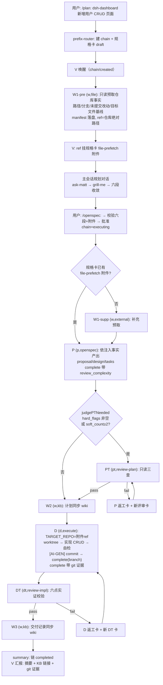

# dsh-kanban 链路模拟：dsh-dashboard 新增用户 CRUD 页面

> 本文基于当前实现的代码事实模拟完整链路运作（非真实运行）。
> 代码依据：`src/routes/prefix-router.ts`、`src/routes/planning-driver.ts`、`src/dispatcher/v-orchestrator.ts`、`src/roles/wiki-worker.ts`。

## 需求

在 `dsh-dashboard` 仓库新增一个「用户管理」CRUD 页面（列表/新建/编辑/删除）。

## 阶段序列（R20）

```
w1-pre → w1-supp(按需跳过) → p → pt(判定触发) → w2 → d → dt → w3 → summary
```

每阶段一张卡，上一阶段完成事件才唤醒下一阶段建卡（R20 逐阶段，B6 幂等防重复建卡）。

---

## 逐步过程

### 步 0 — 需求入口（/plan 路由）

用户在 dsh-dashboard 主会话输入：

```
/plan: dsh-dashboard 新增用户 CRUD 页面
```

`prefix-router` 命中 plan 前缀：

- `createChain`：title 截 60 字符，`workspaceDir` 从 `session.header.cwd` 捕获；
- `createSpecCard`：draft 状态，`problem` = 需求原文，其余五段（solution/user_stories/impl_decisions/testing/out_of_scope）为空；
- `chain/created` 事件唤醒 V。

### 步 1 — W1-pre 仓库预取（批准前唯一可建卡阶段，B4 门控）

V（零执行工具，只路由）收到编排上下文，`kanban_create` 建卡 `(w, file)`。body 按阶段模板：只读获取目标仓库事实。

W agent 执行：

1. `git remote -v` / `git branch` / `git status` 收集仓库元事实（本地路径/远端 URL/当前分支/未提交改动）；
2. `cat` 用户模块目标文件基线（路由、user API、现有页面结构）——需求驱动取关键文件，非全仓复制；
3. manifest 原文落任务工作区（原汁原味，禁压缩/蒸馏）；
4. `prefetch_file` 登记产物引用（source 必须在任务工作区内）；
5. `kanban_complete`，交接 `metadata.ref` = dsh-dashboard 真实绝对路径。

完成事件唤醒 V → 把 ref 挂到规格卡 `file-prefetch` 附件（仅 draft 可挂、幂等）。该附件是 `/openspec:` 批准前置校验条件，也是后续 D 的 `TARGET_REPO` 唯一来源。

### 步 2 — 规划对话（主会话，mattpocock 方法论）

规格卡 draft 期间 V 待命（B4 门控：approved 之前不推进 phase）。主会话按方法论与用户对话：

1. **ask-matt**：一次只问一个问题——CRUD 含哪些字段？是否软删除？列表是否分页？权限点如何控制？（基于规格卡附件的仓库事实提问，不凭空假设）
2. **grill-me**：对每个假设逐项拷问（苏格拉底式），直至用户明确表示没有疑问；
3. **收敛**：结论写入规格卡六段（problem/solution/user_stories/impl_decisions/testing/out_of_scope）。

用户发送 `/openspec:` → `approveIfReady` → `validateSpecCardForApproval` 校验六段齐全 + file-prefetch 附件存在 → 批准 → chain 进入 `executing` → 事件唤醒 V。

### 步 3 — w1-supp（按需跳过）

代码硬逻辑：规格卡已含 file-prefetch 附件（事实已覆盖）或已批准 → 直接 advance，不建卡。本例跳过。

### 步 4 — P 产出 openspec 计划

V 建卡 `(p, openspec)`。P agent（planner-only，不自行探索仓库）：

- 输入 = `spec_card_view` + 注入的 W1-pre 仓库事实交接（源码依据经预取注入，非 P 自查）；
- 产出 openspec 实施计划（proposal/design/tasks）写入自己的任务工作区；
- `kanban_complete` 带 `artifacts_path` + schema 合法的 `review_complexity`。

本例：用户 CRUD 涉及数据库表结构 → `hard_flags: ['db_migration']` 如实申报（`soft_count` 由系统按 soft_flags 计算，禁止伪造）。

### 步 5 — PT 计划评审（系统确定性判定触发）

`judgePTNeeded`：hard_flags 非空 → 需要计划评审 → V 建卡 `(pt, review-plan)`。

PT（只读评审角色）三查：需求对齐（problem/user_stories）、完整性（solution/impl_decisions 覆盖）、逻辑与交互一致性（内部自洽、可执行）。输出 `review_evidence = { verdict, issues }`：

- **pass** → 推进 w2；
- **fail** → 系统创建 P 返工卡 + 新评审卡（返工循环）。

### 步 6 — W2 KB 同步

V 建卡 `(w, kb)`：读父任务交接（P 产物路径）→ `wiki_write` 同步为项目页（`projects/<chain>/<task>.md`，限 pagePrefix 内）→ complete(kb_url, page_path)。禁止任何 git/代码操作。

### 步 7 — D 执行（唯一执行者）

V 建卡 `(d, execute)`。body 要求：

- 首行 `TARGET_REPO=<真实仓库绝对路径>`：必须取自规格卡 file-prefetch 附件 ref（W1-pre 交接的真实路径），禁止写 kanban 存储目录、禁止猜测回退；
- 声明 `TARGET_BRANCH=<目标分支名>`；
- 执行规格卡 solution/testing 段。

D agent（全工具面：bash/fs/jobs/skill/run_code）：

1. git worktree 隔离分支；
2. 实现用户 CRUD 页面（前端页面 + API + 数据库迁移）；
3. 自检：跑测试/构建/typecheck；
4. `<type>: [AI-GEN] <描述>` commit → 推 feature 分支 → complete(branch)；
5. `kanban_complete` 带产物证据：`changed_files` + `commit_hash`/push。无证据则 complete 被拒、链路不闭合。

### 步 8 — DT 交付评审（固定必经）

V 建卡 `(dt, review-impl)`。DT（只读校验+评审，ToolGuard 硬护栏、不注入 git 凭据）六点实证校验，全部通过才算 pass：

1. 测试在 D 的仓库真实运行且 exit 0；
2. build/typecheck/lint 通过（语言无对应项时可豁免）；
3. diff 相对 base 非空；
4. spec 对齐（覆盖 solution/testing、不越界）；
5. git 产物证据存在且可查（changed_files/commit_hash/push 分支）；
6. open-code-review 评审结论（critical/high 已修复或有解释）。

- **pass** → 推进 w3；
- **fail** → 系统创建 D 返工卡 + 新 DT 评审卡；超限 → gave_up。

### 步 9 — W3 收尾同步

V 建卡 `(w, kb)`：读 D 交接 → `wiki_write` 同步交付记录 → complete(kb_url)。禁止任何 git/代码操作。

### 步 10 — summary

`R20_PHASE_EXPECT[summary] = null`，不再建卡；链 completed 由 completeTask 机械规则产生。V 按稳定产物规则（W3 完成后 KB 链接稳定）向用户汇报：交付摘要 + KB 链接 + commit/push 证据。

---

## 流程图



---

## 关键机制备注

| 机制 | 说明 |
|---|---|
| R20 逐阶段建卡 | 每阶段一张卡，上一阶段完成事件后才建下一卡，禁止跨阶段并行 |
| B6 幂等 | 当前 phase 期望卡已存在且未终态 → 不重复建卡（防插件重启重复建卡） |
| B4 门控 | 规格卡 approved 之前 V 只处理 w1-pre，不推进执行链 |
| 评审分流 | pt/dt 建卡后不推进 phase，等 verdict：pass 推进 / fail 返工卡 + 新评审卡 / 超限 gave_up |
| 预取粒度 | W1-pre 按需求取关键事实（元事实 + 目标文件基线 + manifest），非全仓复制；具体文件清单由 V 撰写 body 时指定 |
| TARGET_REPO 来源 | D 的目标仓库路径唯一来源 = 规格卡 file-prefetch 附件 ref（W1-pre 交接），禁止猜测回退 |
| 稳定产物规则 | V 在 W3 完成后（KB 链接稳定）才向用户汇报 |
